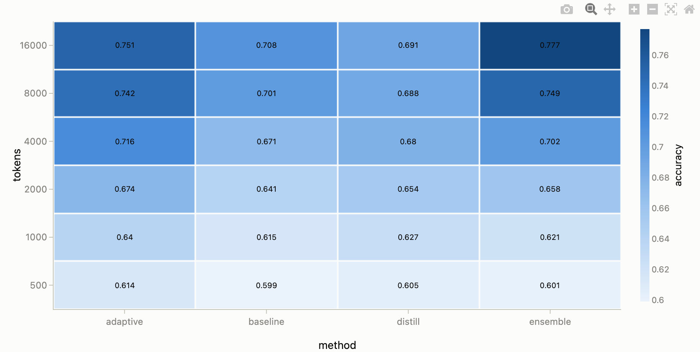
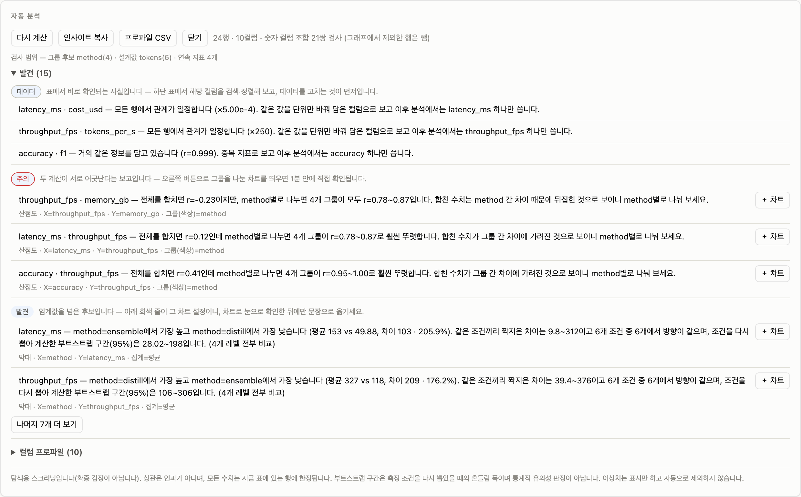
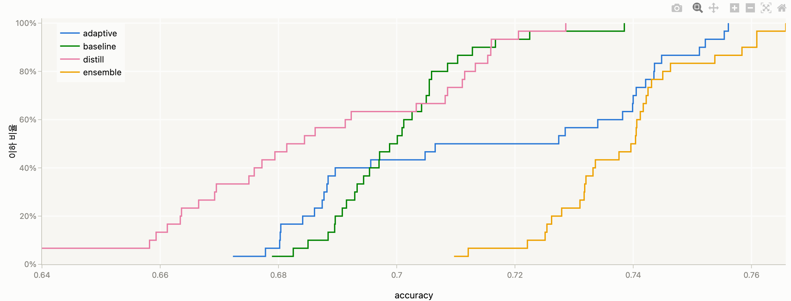
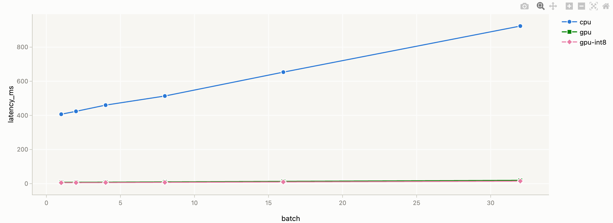
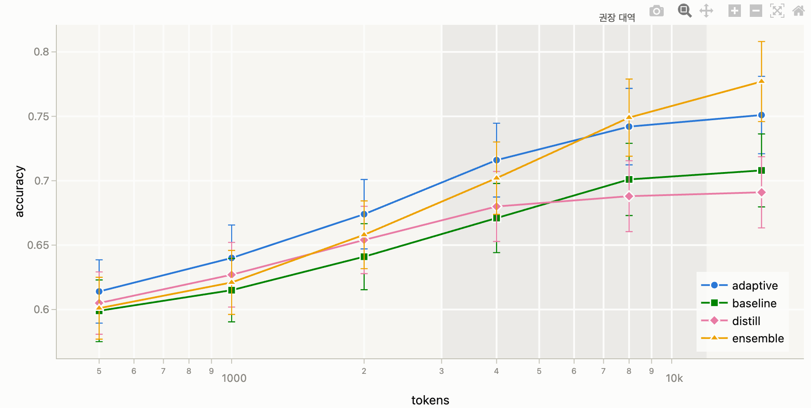
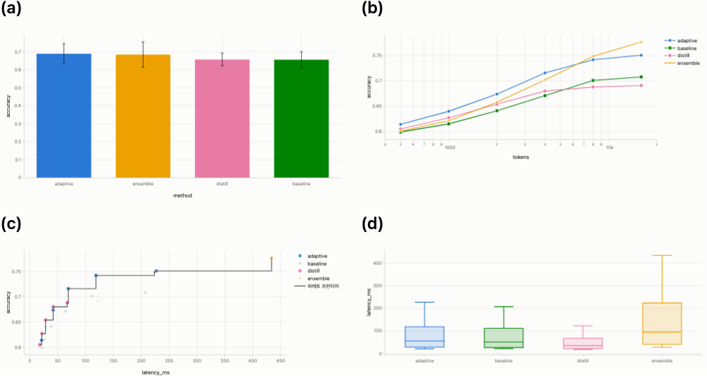
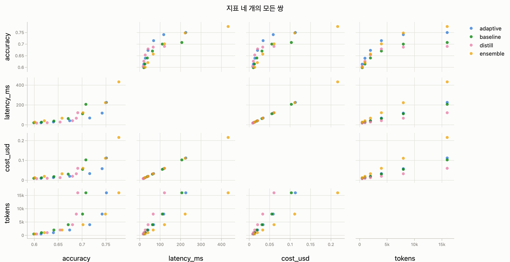
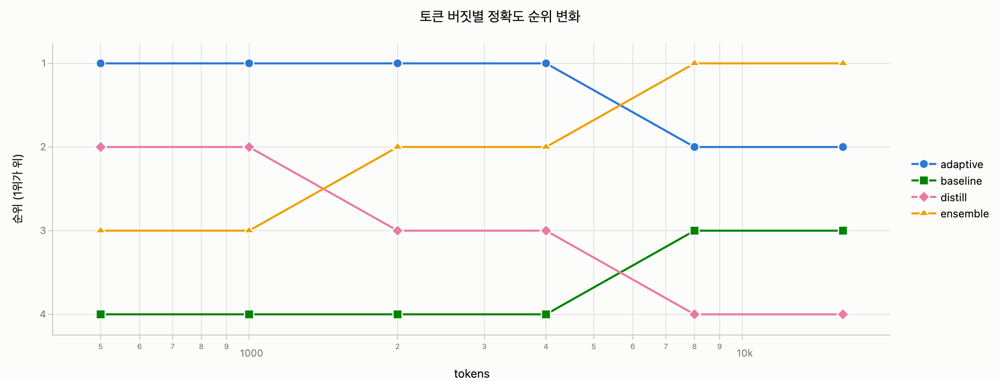

# VTC Visualizer — Visualization Guide

**English** | [한국어](GUIDE.md)

The feature list and controls live in [README.en.md](README.en.md). This document answers the next question:
**"Which chart, with which settings, will actually get my point across?"**
Every example can be followed along with the bundled `example.csv` (4 methods × 6 token-budget sweep).
UI labels below assume the EN toggle (top-right corner).

## 0. Start from the question, not the data

A good chart is not "a picture of all the data I have" — it is **an answer to one question**.
Before building a chart, write the question as a sentence: *"Is ensemble worth its extra cost over baseline?"*,
*"Where do gains saturate as we raise the budget?"* Once the question is fixed, the chart type almost picks itself.

## 1. Choosing a chart

Two criteria drive the choice: **the kind of question**, and **whether X is a continuous quantity (numbers) or discrete items (names)**.

| Question | Data shape | Chart | Options that pair well |
|---|---|---|---|
| "How does it **change**?" (trend, saturation, crossover) | X = continuous (tokens, steps, time) | **Line** or **Scatter + Line** | Trendline, error band (±1σ), log scale |
| "Who is **bigger**?" (magnitude, ranking) | X = item names (method, model) | **Bar** + aggregate | Sort (value descending), value labels, error bars |
| "Which combination **wins**?" (trade-off) | two continuous measures (speed vs accuracy) | **Scatter** | Pareto frontier, baseline + quadrant shading |
| "What is it **made of**?" (breakdown, contribution) | parts that sum meaningfully (cost, time) | **Bar → Stacked** | X as categories |
| "How **reliable** is it?" (repeated-measure spread) | multiple rows per condition (per seed) | **Bar** + aggregate = Mean | Error bars (±std dev/±std error) |
| X is numeric but only **a few settings** (budget 500/1k/…/16k) | discrete numbers | **Line** to stress the trend, **Bar** to stress the gaps | with bars, check "X as categories" |
| **6+ items** or long names | long category list | **Bar → Orientation = Horizontal** | sort to make it a ranking |
| "How much does it **scatter**?" (repeated measurements) | several values per condition | **Box plot** or **histogram** | group (color) overlays one per condition |
| **Two metrics on different scales** | e.g. accuracy and latency | **Second Y axis** | right axis, dotted line with × markers |
| "Which **combination** is good?" (a whole 2D sweep) | two discrete axes + one value (method × budget → accuracy) | **Heatmap** | show cell values, aggregate = Mean |
| "How much does A→B **shift things**?" (paired comparison) | two conditions per item (before/after, 500 vs 16k) | **Dumbbell (paired)** | filter down to the two conditions |

One-line summary: **change → line, magnitude → bar, trade-off → scatter.**

### What to avoid (anti-patterns)

- **Don't stack measures whose sum is meaningless** — a stack of four accuracies "totaling 2.7" says nothing. Stack only quantities where parts genuinely add up (cost, time).
- **Don't put 8+ series in one chart** — colors stop being distinguishable. Filter down to what matters, or `Duplicate` the chart and split by condition (small multiples).
- **Don't label every point** — when everything is highlighted, nothing is. Reserve text markers for the protagonist (the peak, the crossover, your method).
- **Log scale only when "how many times" is the question** — great for axes spanning orders of magnitude, but it hides small absolute differences.
- **Bar value axes start at 0** — bars are read by length, so truncating the axis exaggerates differences (bars already do this by default). Lines/scatter care about change, so zooming to the data range is fine there.

## 2. Recipes by scenario

Recipes use the UI labels verbatim. `Settings → …` refers to the **dock on the left**, opened with a card's `⚙ Settings` (since v0.60 settings open beside the page rather than inside the card — one chart at a time, with the card outlined).

Two things make the recipes easier to follow.

- **You do not have to build the first few charts by hand.** Loading data adds a `Try one of these:` row to the data card — only recipes that **actually draw** with your columns, applied to the first chart on click. If you don't like the result, the toast's `Undo` puts it back.
- **The settings dock starts in `Essentials`** — the 16 rows you use most. If a recipe mentions something you cannot see, type its name in the search box (it finds hidden rows too) or hit `Show … more advanced settings` at the bottom. Anything you have already set stays visible, so nothing you turned on can disappear.

### ① Mean performance per method — "Which method is best?"

> Type=`Bar`, X axis=`method`, Y axis=`accuracy`, Group (color)=`method`
> Data → Aggregate=`Mean`, Error=`Std dev` · Bar options → Value labels=`Value at bar end`, Sort=`Value descending`

Each method's six budget measurements collapse into one mean, and the whiskers (error bars) show how much the budget swings it.
**How to read it**: overlapping error bars signal "this ranking could flip under other conditions."
For seed-repeated experiments, `±std error` is the better choice — it shows confidence in the mean itself.

### ② Budget-sweep trend — "Where do gains saturate?"

> Type=`Scatter + Line`, X axis=`tokens`, Y axis=`accuracy`, Group (color)=`method`
> Axes → X scale=`Log` · Advanced → Trendline=`Log (a+b·ln x)`, Error band=`±1σ shading`

A doubling sweep becomes evenly spaced on a log X axis, straightening the trend.
**How to read it**: the point where the curve flattens is where extra spend stops paying — drop a text marker there and the message is complete.

**The line connects in ascending X**, not file order (text uses the order people read: `v2 → v9 → v10 → v100`).
With repeated seeds several points share an X, so the line passes through them in file order and doubles back — the panel
says so, and setting the aggregate to `Mean` connects one point per X.

### ③ Speed–accuracy trade-off — "Is the latency worth it?"

> Type=`Scatter`, X axis=`latency_ms`, Y axis=`accuracy`, Group (color)=`method`
> Advanced → check Pareto, Direction=`Lower X · Higher Y is better`
> **Click** your reference point (e.g. baseline's production setting) → `📍 Add baseline` → in the settings baseline list, shading=`Upper left`
> (to draw one at a value no data point sits on, type x·y into `＋ Add` in Settings → Baselines)

Only points on the Pareto staircase are rational choices; everything else is dominated. When there are too many points to tell apart, switch on `Fade dominated points`: only the candidates stay solid, and a faded legend swatch means that method put nothing on the frontier. The frontier is computed across all points regardless of group, so several methods usually appear on it. On charts whose series lines are solid (`Scatter + line`), switch `Line style` to dashed to keep the frontier distinct. The colour is selectable too, but if you use both light and dark, leaving it blank so it follows the theme is the safer choice.
Points inside the baseline shading (upper-left = faster **and** more accurate) are the settings worth switching to.

### ④ Cost breakdown — "Who contributes what to total cost per budget?"

> Type=`Bar`, X axis=`tokens`, Y axis=`cost_usd`, Group (color)=`method`
> Bar options → Layout=`Stacked`, check `X as categories`

Total bar height = the sum; each color band = one method's share. `X as categories` is what makes
500–16000 render as evenly spaced bars (unchecked, they sit at their true numeric positions and the left bars get needle-thin).

If the question is **how the composition shifts along a sweep or over time**, stack lines instead of bars —
type=`Line`, Settings → Style → Area fill=`Stack (cumulative area)`. The top edge is the total; each band's thickness is that series' share.
(Stacking draws with SVG instead of WebGL — WebGL has no stacking and would silently overlay.)

- **If the share matters more than the size**, set the bar layout to `Stacked 100% (share)`. Every bar becomes the same height and each block is that series' share — useful where the total grows and you still want to see the mix. With value labels on, the numbers become **shares**, and the value axis says `(%)`.
- **Total and composition are different questions** — at 100% "who grew" disappears. If you need both, duplicate the chart and set one to stacked and the other to stacked 100%.
- **A line chart can fill under one series only** — the fill picker on that series row (`Fill area`). Filling just the protagonist keeps the others readable; stacking stays a chart-wide setting, because stacking only some series makes the "total" unreadable.

### ⑤ Ranking chart — "Throughput order at a glance"

> Type=`Bar`, X axis=`method`, Y axis=`throughput_fps`, Group (color)=`method`
> Data → Aggregate=`Mean` · Bar options → Orientation=`Horizontal`, Sort=`Value ascending`, Value labels=`Value at bar end`

Horizontal bars keep long or numerous item names readable, and with sorting they read like a leaderboard.
(Use `Value ascending` so first place ends up on top.)

### ⑥ Seeing a third dimension — "Keep color=method, but also show frames"

With X=tokens, Y=accuracy, Group (color)=method:

1. **Shape group**=`frames` — color stays method, marker shape encodes frames (recommended; legend shows each combo)
2. **Size column**=`frames` — bigger markers for bigger values (good for continuous values)
3. **Continuous color**=`frames` — a light→dark gradient by value, with a colorbar. **Note: clear Group (color) to "(None)" first** — it can't run alongside group color. Best for a continuous numeric third dimension (not a few categories)
4. **Point labels** with Label column=`frames` — the value appears next to each point
5. **Facet**=`frames` — Settings → Data → Facet: a small chart per frames value, auto-arranged in a grid (no more repeated duplicate+filter)

When the secondary group has many unique values (e.g. 6 frames values → 24 combos) the legend explodes — **filter down to 2–3 contrasting values** before using the shape group.
Filters can be typed by hand, but **clicking a value in the raw-data table is faster** — a menu like `Only 8` appears and
lands on the chart the dock is editing (marked by the outline). Numeric columns take a `Range` operator with a two-handle
slider, and with several filters the join can be `Any may match (OR)` for conditions like "baseline, or ≥ 8000":

### ⑦ Presentation polish — turning a chart into "the slide"

- **Let the title state the conclusion**: Style → Title = "Ensemble overtakes baseline from 8k tokens", not "Accuracy vs Tokens" — the axis labels already say that.
- **Click** the key point → `💬 Add text marker` for an annotation (drag to position; style it in the Point labels group). The marker is **anchored to that point**, so it still points at it after next week's refresh
- For text that belongs to **no single point** — measurement conditions, sample size — use `＋ Pinned note` in the Point labels group; it holds its spot through data and axis changes
- Style → Font size 15–16 (back-of-the-room test); with 2–3 series move the legend to `Inside chart` to save space
- With several charts, put focus in a card and use **`Alt+↑`/`Alt+↓` to reorder**, `Alt+←` to collapse the ones you are not looking at (or the `▾`·`↑`·`↓` buttons in the header)
- To **make several charts look alike at once**, use Style → `Copy this look to…` on your reference chart — only "how it looks" travels (font, size, legend position, chart size); axes, group and filters stay put
- Export with `PNG` (3× resolution, for slides) or `SVG` (papers, vector editing)
- **When you have a submission spec**, pick a preset such as `Paper, 2 columns (170mm)` under Settings → `Export size`. The hint reports the pixels it will save and the pt of body text, so it is immediately clear that small text calls for **a bigger font, not a higher dpi**

### ⑧ Choosing colors — where is the figure going?

The palette picker sits in the top bar. All four pass colorblind-safety validation, so **any of them is safe**; pick by destination.

- **Papers and conferences** → `Okabe-Ito`: familiar to reviewers and still readable in greyscale print.
- **Internal decks and dashboards** → `Carbon`: saturated enough to read on a screen.
- **Figures inside a text document** → `Ink`: quiet, doesn't fight the prose.
- **Otherwise** → `Default`.

A team on one palette gets consistent method colors across every document. Exporting a session carries the palette choice, but a recipient who already picked one keeps theirs.

### ⑨ Build "vs reference" values in the tool — computed columns

Want to see how each setting does **against a reference** (e.g. accuracy difference vs baseline/dense) but the data has no such column? You don't need to regenerate the data — make it on the spot with **computed columns** (the "Computed columns" panel below the data input):

- **Binary op**: new column = A [−, +, ×, ÷] B, or against a **constant** (e.g. `used_tokens ÷ input_tokens` = actual usage ratio, `latency_ms ÷ 1000` = seconds). Which unit reads better depends on the data and the audience — this only adds a column, so you can keep both and pick per chart.
- **Normalize / z-score**: compare metrics on different scales in one chart (0–1, % of max, z-score), optionally **within each group** — "how good is this relative to its own method"
- **Rank**: position inside a group (e.g. the ranking of methods at each budget)
- **Bin**: cut a continuous column into N bins; the labels are strings, so they work directly as groups, filters or colors
- **Group aggregate**: attach a group's mean/sum to every row; combined with the reference delta this gives "how far is this row from its group average"
- **Label join**: not a computation but a naming step — values from several columns are joined into a text column, with text before/after each part and a separator between them (`method` + `frames` → `baseline · 8frm`; `selector` + `frames` → `sal-v3.1 · 16frm`). **One condition combination becomes one item**, so it drops onto a bar X axis, a group or a facet to give you "one row per setup". Sorting is alphabetical, so prefix with `01_` and such when you want a specific order.
- **Delta vs reference**: **difference** or **retention %** vs the reference row with the same match keys (e.g. value=`accuracy`, reference = rows where `method`=`baseline`, match=`tokens` → "how many pt above baseline at the same tokens")

A computed column can feed another one (use `↑`/`↓` in the list to fix the **calculation order**), and `✎` edits a definition.
Deleting one with `×` first tells you which charts use it, and clears their axis and filter settings along with it.
The new column doesn't change your source file, is saved in the session, and is usable immediately as an axis/filter. Presets carry the definitions they need, so teammates get them too. If you don't need it, just collapse the panel — no effect on the view.

### ⑩ A whole 2D sweep in one picture — heatmap

> Type=`Heatmap`, X axis=`method`, Y axis=`tokens`, Color value (column)=`accuracy`, Data → Aggregate=`Mean`, check `Show cell value`

This puts **every combination** of two discrete axes on one canvas. It shines when four overlapping lines become unreadable, or when
you want to expose which cells were never measured. **How to read it**: the point where the colour stops deepening is the point where
more budget stops buying anything. Colour only conveys magnitude, so it is **poor for fine comparisons** — use bars when the exact ranking matters.

### ⑪ The gap between two conditions — dumbbell (paired)

> Type=`Dumbbell (paired)`, Category (X)=`method`, Value (Y)=`accuracy`, Pair group=`tokens`
> Filters → check only `500` and `16000` under `tokens` (dumbbells read best with exactly two conditions)

Instead of two bars side by side, this draws **two dots and a connecting line**, so "how much was gained" is read directly as line length.
**How to read it**: longer line = bigger effect of that condition change. Unlike bars, you see both the starting level and the size of the move.

### ⑫ When you do not know where to start — the `Analyze` button

Just received a dataset and unsure what to plot first? Press `Analyze` in the header. The tool scans the data and reports
**data problems → interpretation cautions → findings**, and each row's `＋ Chart` builds the chart that backs it up.

- **Data** (grey) — constant or empty columns, non-numeric values mixed into numbers (a single `OOM` drops the whole column out of the
  axis candidates), duplicate rows, missing values concentrated in one group, combinations that were never measured. **Fix these first**;
  everything below depends on them.
- **Caution** (red) — relationships that reverse when pooled (Simpson's paradox) and crossovers where the winner changes with the condition.
  These are what stop you from writing a wrong one-line summary.
- **Finding** (grey) — correlations, group differences, saturation points, outliers.

Each tier carries a one-line note on how to check it. The order of how objectively verifiable they are is **Data → Caution → Finding**: data items are counts you can confirm in the table, caution items report a disagreement between two computations that one chart can refute, and findings involve threshold judgements, so they come last. That is why each finding prints **its chart recipe (type · X · Y · group) in grey**, and `＋ Chart` opens exactly that chart — if one with the same setup is already open, the button becomes `Go to chart` and jumps there instead of duplicating it.

#### How to read the findings (and what not to claim)

- **Correlation is not causation.** "A and B move together" does not mean A produces B. Do not convert these into causal claims in a paper or report.
- **Handle "Caution" items before the findings below them.** If the pooled correlation is −0.23 while every method is +0.8 internally,
  the per-method number is the one to report — the pooled figure flipped only because the methods sit at different levels.
- **When a crossover is reported, do not summarise it as one mean.** "A beats B by +0.2pp on average" may only hold below budget 4000.
- **p-values are deliberately absent.** Benchmark rows are not independent (a budget sweep for one method is a connected series) and the
  number of repeats is arbitrary, so significance tests read more generously than the data supports. Instead you get the **raw difference plus
  direction consistency across conditions** (e.g. "6 of 6 conditions agree") — a more useful signal for whether a finding will reproduce.
  Group differences also carry a **bootstrap interval (95%)**: how much the difference would move had the measured conditions been drawn
  again. Findings whose interval spans zero are not reported at all. Read it as spread, not as a significance verdict — "difference 103,
  interval 28 to 198" means the direction is clear but the size depends heavily on the condition, while "difference 10, interval 9.98 to
  10.02" means it barely varies at all.
- **Outliers are flagged, never removed.** They may be measurement errors or real behaviour, so inspect the value and exclude it yourself
  with the table checkbox if you decide to.
- **Finding nothing is also a result.** It means nothing cleared the thresholds, and relationships dug up by lowering them rarely reproduce.

The analysis runs on **the rows still in the table** (rows excluded from charts are left out) and is discarded whenever the data changes. It is never stored in the session.
If nothing at all is reported, read the **scan scope** line at the top of the panel: it lists which columns were treated as groups and conditions and what was excluded and why, which tells you whether the relationships were weak or there were simply no conditions to compare.

### ⑬ Exporting a report — figures with their sentences

Once the charts are polished, write one or two sentences into Settings → Style → **Caption** for each ("what this figure says") and pick `Export ▾` → `Report MD`.
You get one markdown file plus the chart PNGs; every chart section carries its **caption, setup and the filters in effect**, and if the analysis has been run, its findings summary and caveat are appended.

**Why the filter conditions must travel with the figure**: a conclusion that only holds for tokens ≤ 4000, screenshotted with the filter on and pasted without stating it, will be read as a conclusion about the whole dataset. The report writes that condition down for you.
When moving findings into prose, do not convert them into causal claims (see "How to read the findings" in ⑫) and keep only what you need.

**When you need the numbers next to the picture** — the card's `Table` button shows the chart's own columns, with the chart's filters applied.
It is where you check "what exactly is that point", and for anyone who cannot see the graph it is the only way to read it.
The table redraws whenever the plot does, so the two can never disagree.

### ⑭ Living with a weekly log

Re-adding a file under the same name replaces the data and keeps your chart settings. it also keeps **the work you did by hand**:
rows you excluded, rows you faded, point labels you dragged into place — and, **text markers** — all carry over.
Rows are recognised by their **condition columns** (method, tokens — the ones with few distinct values), so refreshed measurements still map to the same row.
If the conditions themselves change (a new method appears), those count as new rows.
When the point a marker referred to is gone, it is **hidden rather than left in the wrong place**, and you're told — check Settings → Point labels for the ⚠ and its reason, then `Re-anchor` it to another point or delete it.

You can also drop a whole log folder at once — loading many files redraws the table and charts **once, at the end**, and
files that could not be read are collected into one line (`Could not read N file(s) — Details`) instead of one dialog each.

**Serving the folder makes refreshing safe** — that data is not kept in the browser at all; it is re-read from the folder each time you open the page.
Files you add by hand are kept in the browser (IndexedDB) too, so even a 200k-row file is still there after a refresh.
When there is nowhere to put it, **the chart settings come back on their own**, with dashed chips naming the files to add again.

With a folder served, overwriting the file and reloading is enough to pick up the new values
(`python visualizer.py logs/`, plus `--offline` if you want the CDN-free build).

**While a run is in progress**, tick `Watch folder` on the page (it appears only when served).
Files reload as they change and, as above, **the exclusions and fading you marked by hand survive**.
A file that briefly disappears (mid-write, mid-rename) is not dropped from the screen — you didn't delete it, and there would be no way back.

**With several files open** — the `Data` dropdown at the top of a chart's settings picks which file it draws, and the column
lists narrow to that file, so unrelated schemas can sit open together with each chart pointing somewhere different.
To **compare files with the same schema**, leave it on `(all)` and facet by `_source` (one small chart per file) or set group
(color) to `_source` (overlaid).

**When the columns keep piling up** — for logs that grow to 20-40 columns, switch off the ones you are not using right now
via the table's `Columns n/m` button. A switched-off column leaves the table, axis pickers, filters and the analysis together,
so the dropdowns get short again. The data is untouched, `Show all` brings everything back, and charts already drawn on a
hidden column keep drawing. It also works as an analysis control: switch off a column you don't want scanned.

### ⑮ The spread of repeated runs — what a box hides

Results from repeated seeds lose half their story when reduced to "the mean".
The three figures below are **the same data** (4 methods × 30 seeds) drawn three ways —
it is `seeds.csv`, which arrives with `More examples`, so you can follow along exactly.

> type=`Box plot`, Y=`accuracy`, group (colour)=`method`, data=`seeds.csv`

A box reports quartiles and whiskers. `adaptive` has a wide box and so does `distill` — **whether they are wide for the same reason is not visible.**

> switch the type to `Violin`

`adaptive` has **two peaks**. Results split into two branches depending on configuration or initialisation,
and no mean, median or quartile can show that. `distill` really is evenly spread; `ensemble` is tight.
**The box and mean line stay inside the violin**, so the summary is not lost.

> switch the type to `Cumulative (ECDF)`

**Read "what fraction is at or below this value" vertically.** With a fixed threshold ("must clear 0.72 to ship") this is the most direct picture.
The **flat stretch** in the middle of `adaptive` is bimodality wearing another face — no value was ever observed in that range.
It is drawn as steps for the same reason: straight lines would **assign probability to values never observed**.

**Which to use** — below about ten values per method the violin's curve looks smoother than the evidence warrants, so a box or the raw points is more honest.
Reach for ECDF when a threshold is the question, violin when the shape is, box when many conditions must sit side by side.

### ⑯ When values split into two groups — a broken axis

Sometimes one metric spans orders of magnitude (CPU vs GPU latency, a small model vs a large one).
On a single axis the smaller group is pinned to the floor and its members **cannot even be told apart**.
`scales.csv` (3 backends × 6 batch sizes) from `More examples` in the data card follows this recipe exactly.

> Type=`Scatter + line`, X=`batch`, Y=`latency_ms`, Group (colour)=`backend`, Data=`scales.csv`

Only `cpu` reads; `gpu` and `gpu-int8` look like a single overlapping line — even though they differ by 30%.

> Change the type to `Broken axis` and leave the range empty

**The axis splits in two and the space between is folded away, marked `⁄⁄`.** Each group gets its own range,
so the gap between `gpu` and `gpu-int8` reads alongside the growth of `cpu`.
**Axis values stay real** — hover, the `Table` view and exported CSV/reports all report the unfolded numbers.

- **Leave the range empty for automatic.** The largest empty span is folded, but only when it exceeds 25% of the
  full range and has at least two points on each side. If nothing is worth folding it draws as an ordinary chart **and says so**.
- To choose it yourself, enter two numbers in `Break range` (e.g. `20` to `380`).
- If it is X that splits (token budgets of 500–2,000 and 100,000), switch `Break` to `X axis`.
- Baselines, text markers and shaded spans attach to **whichever panel holds their value**; a span crossing the
  break is drawn as two pieces.

**When not to use it** — if values grow by *multiples* (1, 10, 100, 1000) a log axis is the right answer.
A broken axis is for two groups that each need to read linearly.
And never on **bars** (which is why the bar type has no break) — a bar's length *is* the quantity, so breaking
the axis makes the picture lie. If the two are different metrics, a **secondary Y axis** is the right tool.

### ⑰ When the CSV came in wide — melting

A file whose columns run sideways (`baseline, ours, ablation`) does not match this tool's premise of one row per measurement.
Axes, groups and filters all assume one column means one thing, so as-is there is no way to colour by method.

To try it, press `More examples` in the data card — `wide.csv` is exactly this shape.

> `⇲` on the dataset chip → in the melt list **uncheck the condition columns (tokens and friends)**, leaving the measurements → `Melt and add`

The original is untouched and a `…-long.csv` appears. The new `variable` column *is* the method, so it works as a group/facet/filter straight away.
**The default guess is wrong often** — sweep knobs are numeric too, so move the condition columns across by hand.
The preview says how many rows you will get before you commit.

### ⑱ When measurements and metadata live in different files — joining

Measurements live in the run log, while model parameters or unit prices sit in a separate table. That split is common,
and opening both files only stacks rows — so a chart like "accuracy vs parameter count" was out of reach.

`More examples` brings in `methods.csv` (`params_b` and `price_per_1k` per `method`). Pair it with `example.csv` and follow along.

> Computed columns → kind=`Look up from another file` → from=`methods.csv`, column=`params_b`, match key=`method`
> New chart: X axis=`params_b`, Y axis=`accuracy`, group=`method`

Only columns present in **both** files are offered as keys, and choosing one immediately reports **how many rows will find a match** —
zero means the key is wrong, and you know before committing. Several matches fold via first/mean/sum/min/max/count.
**Rows are never added** (only a column). Four metadata fields means four definitions.

### ⑲ A figure that meets the submission spec — size, error, ranges

What reads well on screen and what reads well in a paper are different things.

> Settings → Export size → preset=`Paper, 2 columns (170mm)`, dpi=`300`
> Settings → Data → Error=`accuracy_std` (column) — when the ± value already exists as a column. The example is `repeat.csv`
> Settings → Baselines → `＋ Span` to shade the range you want to call out

- **If the text is small, raise the font size, not the dpi.** The hint shows the resulting pt — dpi does not change the physical text size.
- The single `Error` row picks **column or statistic** — a precomputed `_std` column draws as-is, and `Std dev`/`Std error` appear only when the aggregate is `Mean` (the column is ignored while aggregating).
- **Name your baselines** — the name box in Settings → Baselines prints e.g. `Target 0.72` next to the line. A bare line cannot tell the reader whether it is the target or last year's number.
- **To paint pass/fail, shade one side** — `Shade above`/`Shade below` for a horizontal line, `right`/`left` for a vertical one. Pick the direction **first** when adding a baseline (the box that direction does not use is locked). The shade color is yours too; leave it empty to follow the theme.
- **Span shading says what a baseline cannot** — if a baseline is "this line", a span is "this range" (a recommended band, an out-of-memory region).
- Figures in the markdown report follow the same spec.

### ⑳ Four figures on one sheet — panel layout

The (a)–(d) panel figure that papers want is usually assembled by hand somewhere else. The tool can produce it directly.

> Draw every chart you want first (use Style → `Copy this look to…` to match fonts and sizes if needed)
> Top bar `Export ▾` → `Several figures on one sheet…` → Columns=`2`, Panel labels=`(a) (b) (c)`, unit=`mm`, width=`170`, dpi=`300`

- **The width is the width of the whole sheet**, not of one panel. 170mm for a two-column paper, 85mm for a single column.
- **Each panel keeps the aspect ratio it has on screen.** Stretching panels to equal heights would give each a different tick spacing, which makes the comparison lie — if you want them to match, set each chart's `Chart size` first.
- Pick the charts to include with the checkboxes. Collapsed cards count too, as long as they have been drawn.
- To add captions or arrows on top, open the saved PNG with `Export ▾` → `Annotate an image…`.

### ㉑ Where to look first when there are many metrics — scatter matrix

Seeing how accuracy, latency, cost and size relate meant one chart per pair — five metrics is ten pairs.
Scan them in one figure, then dig into the pair that caught your eye with a normal scatter plot.

> Type=`Scatter matrix` → add `accuracy` · `latency_ms` · `cost_usd` · `tokens` to Columns, in that order
> Group (color)=`method` · Show=`Both halves`

- **The order you pick is the grid order.** Put the two you care about next to each other and their cell lands beside the diagonal.
- If seeing each pair twice bothers you, set `Show` to `Lower half`.
- **Up to 8 columns** are drawn. Beyond that the cells are too small to read, so the extras are left out and the panel says how many.
- With many rows the cells clog up. Past the `Point cap` (5,000 by default) an **evenly spaced sample** is drawn and said so — the same points every time. Set the cap to `0` to draw them all.
- This type is drawn with WebGL, so **an SVG export embeds the points as raster** (axes and text stay vector). For print, use a PNG at a higher dpi.
- Move whatever stood out into a scatter plot to add baselines, a Pareto front or trend lines. The matrix picks **where to look**; it is not the figure that makes the argument.

### ㉒ How the ranking flipped — bump chart

Sometimes the **placing** matters, not the gap. If the sentence you want is "past 8000 tokens the leader changed", a rank axis says it faster than a value axis.

> Computed column → kind=`Rank`, of=`accuracy`, within=`tokens`, tick descending → name it `rank`
> New chart: Type=`Scatter + line`, X axis=`tokens` (log), Y axis=`rank`, Group (color)=`method`
> Axis → tick `Reverse axis` `Y`, Y tick format=`Integer · step 1 (1 2 3)`

- **Without reversing, first place sits at the bottom.** Rank is a smaller-is-better value, so the axis has to be flipped for "up = good" to hold.
- Without `Integer · step 1` the ticks land every 0.5 and read `1, 1, 2, 2`.
- **Dropping the gaps is the point and the trap** — first and second are one step apart whether the difference is 0.001 or 0.1. Put it beside the value chart (recipe ②) rather than letting it stand alone.
- What you pick for `within` defines what the placing is *within*: `tokens` for a per-budget ranking, empty for an overall one.

## 3. Principles for effective charts (summary)

1. **One chart, one message** — want to say two things? Duplicate into two charts.
2. **Emphasis only works when it's scarce** — labels, markers, shading go on the protagonist only.
3. **Color follows the entity** — the same method keeps the same color across every chart. The tool enforces this automatically (filters don't repaint survivors); keep the principle when overriding series colors by hand.
4. **Put the reference in the picture** — "better/worse" only means something against a baseline. Click your reference point, or type its value into Settings → Baselines, and pin it as dotted lines.
5. **Don't hide uncertainty** — if you have repeated measurements, turning on error bars/bands is what makes the chart honest.
6. **Units live in axis labels** — the column-name convention (`latency_ms`, `cost_usd`) shows up on the axes as-is; refine via Axes → X/Y label when ambiguous.

## 4. Sharing with your team

- **Share charts with their settings**: `Export ▾` → `Export session` (top bar) → one JSON file holds the data and every chart's configuration. The recipient restores the exact screen with `Import session`.
- **Presets vs sessions**: a session = data + charts; a **preset = chart settings only** (the `Presets` button on each card). When the data changes but the schema stays the same — weekly experiment logs, say — a saved preset redraws the same chart on new data in one click.
- **Converting data**: whatever your format, paste the [agent prompt](README.en.md#converting-your-data-to-this-format-agent-prompt) from the README into any LLM together with your file.
- **Offline distribution**: copying the single `index-offline.html` file is enough — it works identically with no internet.

## Marking up a capture for a report

Sometimes the picture does not finish the sentence — "it bends here", "this range ran out of memory", "please cover this value".
Annotations tied to the data (text markers, span shading) belong in the main app; marks drawn **on the capture itself** live in `Export ▾ → Annotate an image…`.

- Pasting (⌘/Ctrl+V) is the fastest way in for a screenshot. Saving the chart PNG and dragging it works too.
- `Arrow` points at one spot, `Box` groups a region, `Text` adds a line.
- **`Redact` is for covering account names, paths and figures before sharing.** It paints opaque, so nothing shows through.
- Exports are 1x/2x of the original resolution — viewing it shrunk to fit never shrinks the file.

> If the mark needs to **follow the data**, use a text marker in the main app instead.
> Marks on a capture are burned into the picture, so changing data means capturing again.

---

© mrc
