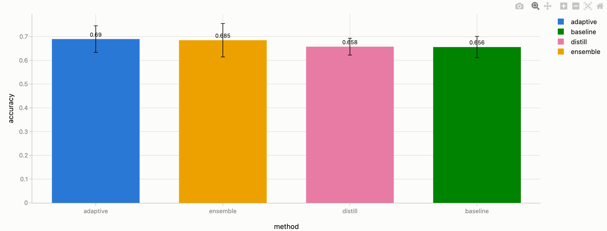
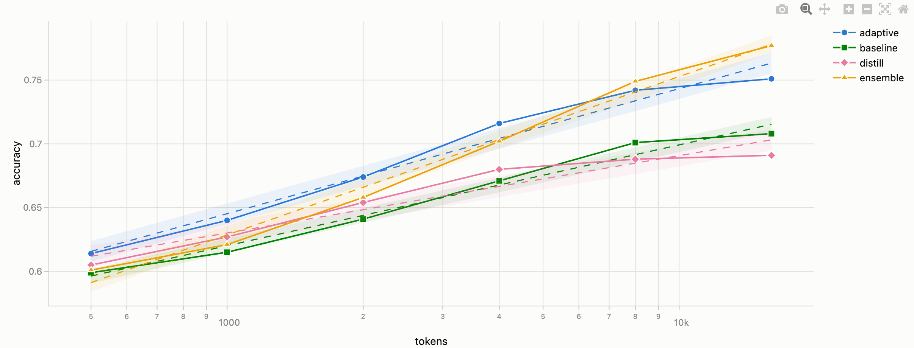
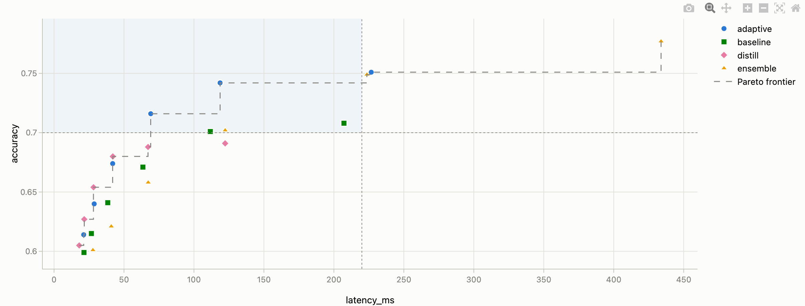
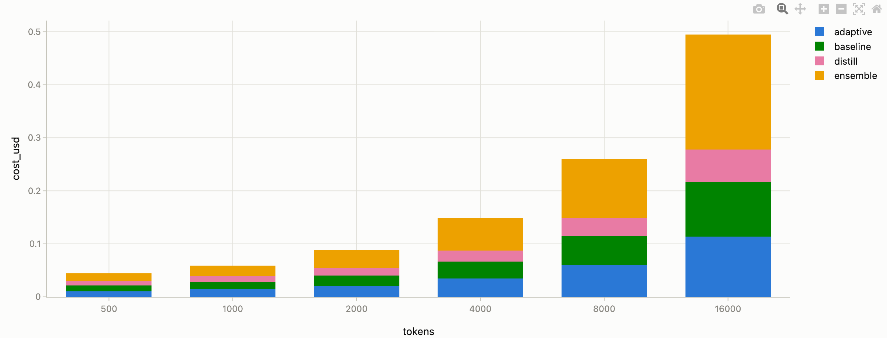
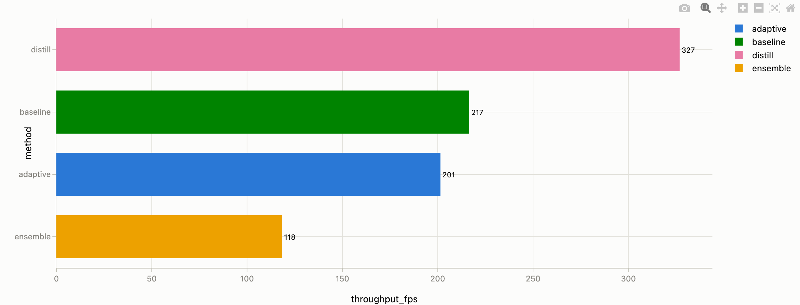
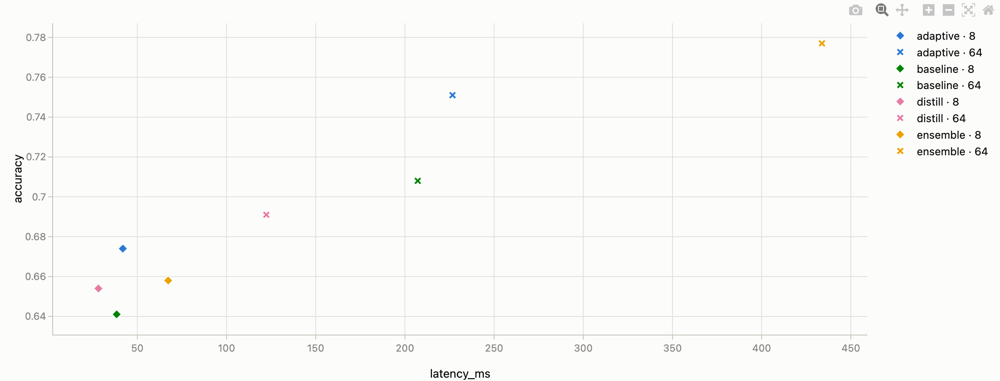
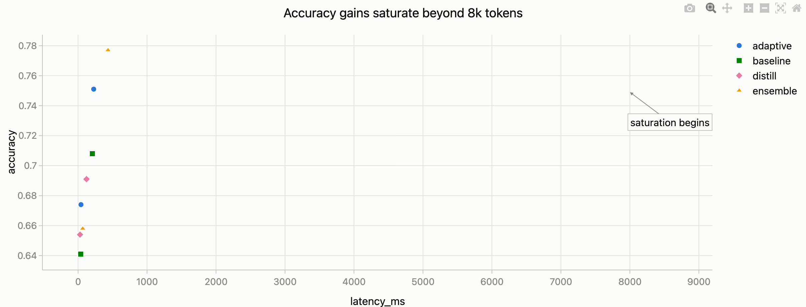

# VTC Visualizer — 시각화 가이드

[English](GUIDE.en.md) | **한국어**

기능 목록과 조작법은 [README.md](README.md)에 있습니다. 이 문서는 그 다음 질문,
**"내 데이터에는 어떤 차트를, 어떤 설정으로 그려야 잘 전달되는가"** 를 다룹니다.
모든 예시는 동봉된 `example.csv`(4개 method × 토큰 버짓 6개 스윕)로 바로 따라 할 수 있습니다.

## 0. 출발점: 데이터가 아니라 질문에서 시작하기

좋은 그래프는 "가진 데이터를 다 보여주는 그림"이 아니라 **"하나의 질문에 대한 답"**입니다.
차트를 만들기 전에 문장으로 먼저 써보세요 — *"ensemble이 baseline보다 비싼 만큼 성능이 좋은가?"*,
*"버짓을 늘리면 어디서부터 이득이 포화되는가?"* 질문이 정해지면 차트 선택은 거의 자동으로 따라옵니다.

## 1. 차트 선택 가이드

핵심 기준은 두 가지입니다: **질문의 종류**, 그리고 **X축이 연속량(숫자)인지 이산 항목(이름)인지**.

| 질문 | 데이터 형태 | 추천 차트 | 함께 쓰면 좋은 옵션 |
|---|---|---|---|
| "얼마나 **변하는가**" (추세·포화·교차) | X = 연속량 (tokens, step, 시간) | **선** 또는 **산점도+선** | 추세선, 오차 밴드(±1σ), 로그 스케일 |
| "누가 더 **큰가**" (크기 비교·순위) | X = 항목 이름 (method, 모델) | **막대** + 집계 | 정렬(값 내림차순), 값 표시, 오차 막대 |
| "어느 조합이 **유리한가**" (트레이드오프) | 두 지표 모두 연속량 (속도 vs 정확도) | **산점도** | Pareto frontier, 베이스라인 + 사분면 음영 |
| "무엇으로 **구성되는가**" (내역·기여분) | 합이 의미 있는 양 (비용, 시간) | **막대 → 쌓기(스택)** | X를 카테고리로 |
| "얼마나 **믿을 만한가**" (반복 측정 편차) | 같은 조건의 행 여러 개 (seed별) | **막대** + 집계=평균 | 오차 막대(±표준편차/±표준오차) |
| X가 숫자지만 **몇 개의 설정값** (버짓 500/1k/…/16k) | 이산적 숫자 | 추세 강조면 **선**, 격차 강조면 **막대** | 막대일 때 "X를 카테고리로" 체크 |
| 항목이 **6개 이상**이거나 이름이 김 | 긴 카테고리 목록 | **막대 → 방향=가로** | 정렬로 랭킹화 |

한 줄 요약: **변화는 선, 크기는 막대, 트레이드오프는 산점도.**

### 피해야 할 것 (안티패턴)

- **합이 무의미한 지표를 스택하지 않기** — accuracy 4개를 쌓은 막대의 "총합 2.7"은 아무 의미가 없습니다. 스택은 비용·시간처럼 부분의 합이 전체인 양에만.
- **시리즈 8개 이상을 한 차트에 넣지 않기** — 색을 구분할 수 없게 됩니다. 필터로 핵심만 남기거나, 차트를 `복제`해 조건별로 나란히 놓으세요(small multiples).
- **모든 점에 값 레이블 붙이지 않기** — 전부 강조하면 아무것도 강조되지 않습니다. 이야기의 주인공(최고점, 교차점, 우리 방법)에만 텍스트 마커를 다세요.
- **로그 스케일은 "몇 배 차이"가 질문일 때만** — 10~16000처럼 자릿수가 넘나드는 축엔 유용하지만, 미세한 절대 차이를 보여줄 땐 오히려 차이를 숨깁니다.
- **막대의 값 축은 0에서 시작** — 막대는 길이로 읽히므로 축을 잘라내면 차이가 과장됩니다(막대의 기본 동작이 이미 0 시작). 반면 선/산점도는 변화가 관심사이므로 데이터 범위로 확대해도 됩니다.

## 2. 시나리오별 레시피

아래 레시피는 UI 라벨 그대로 적었습니다. `설정 → …`은 각 차트 카드의 `⚙ 설정` 패널 기준입니다.

### ① 방법별 평균 성능 비교 — "어느 method가 가장 좋은가?"

> 유형=`막대`, X 축=`method`, Y 축=`accuracy`, 그룹(색상)=`method`
> 막대 옵션 → 집계=`평균`, 오차 막대=`±표준편차`, 값 표시=`막대 끝에 값`, 정렬=`값 내림차순`

각 method의 버짓 6개 측정이 평균 하나로 요약되고, 수염(오차 막대)이 버짓에 따른 변동 폭을 보여줍니다.
**읽는 법**: 오차 막대가 서로 겹치면 "이 평균 차이는 조건에 따라 뒤집힐 수 있다"는 신호입니다.
seed 반복 실험이라면 `±표준오차`가 평균 자체의 신뢰도를 보여주므로 더 적합합니다.

### ② 버짓 스윕 추세 — "토큰을 늘리면 어디서 포화되는가?"

> 유형=`산점도+선`, X 축=`tokens`, Y 축=`accuracy`, 그룹(색상)=`method`
> 축 → X 스케일=`Log` · 고급 → 추세선=`로그 (a+b·ln x)`, 오차 밴드=`±1σ 음영`

버짓이 2배씩 늘어나는 스윕은 로그 X축에서 등간격이 되어 추세가 곧게 펴집니다.
**읽는 법**: 곡선이 평평해지기 시작하는 지점이 "돈을 더 써도 이득이 없는" 포화점 — 텍스트 마커로 그 지점에 주석을 달면 메시지가 완성됩니다.

### ③ 속도–성능 트레이드오프 — "지연을 감수할 가치가 있는가?"

> 유형=`산점도`, X 축=`latency_ms`, Y 축=`accuracy`, 그룹(색상)=`method`
> 고급 → Pareto 체크, 방향=`X작을수록·Y클수록 좋음`
> 기준점(예: baseline의 운영 설정) **클릭** → `📍 베이스라인 추가` → 설정의 베이스라인 목록에서 음영=`좌상단`

Pareto 계단선 위의 점만이 "합리적인 선택지"이고, 나머지는 지배당한 설정입니다.
베이스라인 음영(좌상단 = 더 빠르고 더 정확한 영역)에 들어온 점이 곧 "갈아탈 이유가 있는" 설정입니다.

### ④ 비용 내역 — "버짓별 총비용에서 누가 얼마를 차지하나?"

> 유형=`막대`, X 축=`tokens`, Y 축=`cost_usd`, 그룹(색상)=`method`
> 막대 옵션 → 배치=`쌓기 (스택)`, `X를 카테고리로` 체크

막대 전체 높이 = 총합, 색 구간 = 각 method의 기여분. `X를 카테고리로`를 켜야
500~16000이 등간격으로 나란히 그려집니다(끄면 실제 숫자 간격대로 배치되어 왼쪽 막대가 얇아짐).

### ⑤ 랭킹 차트 — "처리량 순위를 한눈에"

> 유형=`막대`, X 축=`method`, Y 축=`throughput_fps`, 그룹(색상)=`method`
> 막대 옵션 → 방향=`가로`, 집계=`평균`, 정렬=`값 오름차순`, 값 표시=`막대 끝에 값`

가로 막대는 항목 이름이 길거나 많을 때 레이블이 겹치지 않고, 정렬과 결합하면 순위표처럼 읽힙니다.
(가로에서는 위쪽이 1등이 되도록 `값 오름차순`을 씁니다.)

### ⑥ 세 번째 차원 함께 보기 — "색=method인 채로 frames 경향도 보고 싶다"

X=tokens, Y=accuracy, 그룹(색상)=method 상태에서:

1. **모양 그룹**=`frames` — 색은 method, 마커 모양은 frames (가장 권장, 범례에 조합별 표시)
2. **크기 컬럼**=`frames` — 값이 클수록 마커가 커짐 (연속값에 적합)
3. **포인트 레이블**의 레이블 컬럼=`frames` — 각 점 옆에 값 표시
4. 차트 `복제` 후 필터로 frames 값별 분리 — 나란히 비교 (small multiples, 시리즈가 많아질 때 최선)

2차 그룹의 고유값이 많으면(예: frames 6개 → 조합 24개) 범례가 폭발하니, **필터로 대비되는 2~3개 값만 남기고** 모양 그룹을 쓰세요:

### ⑦ 발표용 마무리 — 차트를 "슬라이드 한 장"으로

- **제목이 결론을 말하게**: 스타일 → 제목에 "ensemble, 8k 토큰부터 baseline 추월" 처럼 발견 자체를 적으세요. "Accuracy vs Tokens"는 축 레이블이 이미 하는 말입니다.
- 핵심 포인트 **클릭** → `💬 텍스트 마커 추가`로 주석 (드래그로 위치 조정, 스타일은 포인트 레이블 그룹에서)
- 스타일 → 글자 크기를 15–16으로 (발표장 뒷자리 기준), 범례는 시리즈가 2~3개면 `차트 안`으로 옮겨 공간 절약
- 내보내기는 `PNG`(3배 해상도, 슬라이드용) 또는 `SVG`(논문·벡터 편집용)

## 3. 효과적 전달 원칙 (요약)

1. **차트 하나에 메시지 하나** — 두 가지를 말하고 싶으면 차트를 복제해 두 장으로.
2. **강조는 희소해야 강조다** — 레이블·마커·음영은 주인공에만.
3. **색은 항목을 따라 고정** — 같은 method는 모든 차트에서 같은 색이어야 합니다. 도구가 자동으로 지켜주지만(필터를 걸어도 색 유지), 시리즈 색을 직접 바꿀 때도 이 원칙을 유지하세요.
4. **비교 기준을 그림 안에** — "좋다/나쁘다"는 베이스라인이 있어야 성립합니다. 기준점을 클릭해 점선으로 박아두세요.
5. **불확실성을 숨기지 않기** — 반복 측정이 있다면 오차 막대/오차 밴드를 켜는 것이 정직한 그래프입니다.
6. **단위는 축 레이블에** — 컬럼명 규칙(`latency_ms`, `cost_usd`)이 그대로 축에 보이므로, 모호하면 축 → X/Y 레이블로 다듬으세요.

## 4. 팀과 공유하기

- **차트 설정째 공유**: 상단 `세션 내보내기` → JSON 파일 하나에 데이터+차트 설정이 모두 담깁니다. 받은 사람은 `세션 가져오기`로 똑같은 화면을 복원합니다.
- **프리셋 vs 세션**: 세션 = 데이터+차트 전부, **프리셋 = 차트 설정만**(카드의 `프리셋` 버튼). 매주 갱신되는 실험 로그처럼 **데이터는 바뀌고 스키마는 같은** 경우, 프리셋을 저장해 두면 새 데이터에 클릭 한 번으로 같은 차트를 다시 그립니다.
- **데이터 변환**: 포맷이 무엇이든 README의 [에이전트 요청문](README.md#내-데이터를-이-포맷으로-변환하기-에이전트-요청문)을 LLM에 붙여넣으면 입력 계약에 맞는 CSV/JSON으로 변환됩니다.
- **오프라인 배포**: `index-offline.html` 파일 하나만 복사하면 인터넷 없는 곳에서도 동일하게 동작합니다.

---

© mrc
