# VTC Visualizer — 시각화 가이드

[English](GUIDE.en.md) | **한국어**

기능 목록과 조작법은 [README.md](README.md)에 있습니다. 이 문서는 그 다음 질문,
**"내 데이터에는 어떤 차트를, 어떤 설정으로 그려야 잘 전달되는가"** 를 다룹니다.
모든 예시는 동봉된 `example.csv`(4개 method × 토큰 버짓 6개 스윕)로 바로 따라 할 수 있습니다.

## 0. 출발점: 데이터가 아니라 질문에서 시작하기

좋은 그래프는 "가진 데이터를 다 보여주는 그림"이 아니라 **"하나의 질문에 대한 답"**입니다.
차트를 만들기 전에 문장으로 먼저 써보세요 — *"ensemble이 baseline보다 비싼 만큼 성능이 좋은가?"*,
*"버짓을 늘리면 어디서부터 이득이 포화되는가?"* 질문이 정해지면 차트 선택은 거의 자동으로 따라옵니다.

## 1. 차트 선택 가이드

핵심 기준은 두 가지입니다: **질문의 종류**, 그리고 **X축이 연속량(숫자)인지 이산 항목(이름)인지**.

| 질문 | 데이터 형태 | 추천 차트 | 함께 쓰면 좋은 옵션 |
|---|---|---|---|
| "얼마나 **변하는가**" (추세·포화·교차) | X = 연속량 (tokens, step, 시간) | **선** 또는 **산점도+선** | 추세선, 오차 밴드(±1σ), 로그 스케일 |
| "누가 더 **큰가**" (크기 비교·순위) | X = 항목 이름 (method, 모델) | **막대** + 집계 | 정렬(값 내림차순), 값 표시, 오차 막대 |
| "어느 조합이 **유리한가**" (트레이드오프) | 두 지표 모두 연속량 (속도 vs 정확도) | **산점도** | Pareto frontier, 베이스라인 + 사분면 음영 |
| "무엇으로 **구성되는가**" (내역·기여분) | 합이 의미 있는 양 (비용, 시간) | **막대 → 쌓기(스택)** | X를 카테고리로 |
| "얼마나 **믿을 만한가**" (반복 측정 편차) | 같은 조건의 행 여러 개 (seed별) | **막대** + 집계=평균 | 오차 막대(±표준편차/±표준오차) |
| X가 숫자지만 **몇 개의 설정값** (버짓 500/1k/…/16k) | 이산적 숫자 | 추세 강조면 **선**, 격차 강조면 **막대** | 막대일 때 "X를 카테고리로" 체크 |
| 항목이 **6개 이상**이거나 이름이 김 | 긴 카테고리 목록 | **막대 → 방향=가로** | 정렬로 랭킹화 |
| "얼마나 **흩어지는가**" (반복 측정의 분포) | 같은 조건의 값 여러 개 | **바이올린**(모양까지) · 박스플롯(요약) · 히스토그램 · **ECDF**(임계값 읽기) | 그룹(색상)으로 조건별 겹쳐 보기 — 레시피 ⑱ |
| 스케일이 다른 **두 지표를 함께** | 예: accuracy와 latency | **보조 Y축** | 오른쪽 축, 점선·× 마커로 구분 |
| "**어느 조합**이 좋은가" (2D 스윕 전체) | 이산 축 2개 + 값 1개 (method × 버짓 → 정확도) | **히트맵** | 셀 값 표시, 집계=평균 |
| "조건 A→B로 **얼마나 달라지는가**" (짝 비교) | 항목마다 두 조건 (전/후, 500 vs 16k) | **덤벨(짝 비교)** | 필터로 두 조건만 남기기 |

한 줄 요약: **변화는 선, 크기는 막대, 트레이드오프는 산점도.**

### 피해야 할 것 (안티패턴)

- **합이 무의미한 지표를 스택하지 않기** — accuracy 4개를 쌓은 막대의 "총합 2.7"은 아무 의미가 없습니다. 스택은 비용·시간처럼 부분의 합이 전체인 양에만.
- **시리즈 8개 이상을 한 차트에 넣지 않기** — 색을 구분할 수 없게 됩니다. 필터로 핵심만 남기거나, 차트를 `복제`해 조건별로 나란히 놓으세요(small multiples).
- **모든 점에 값 레이블 붙이지 않기** — 전부 강조하면 아무것도 강조되지 않습니다. 이야기의 주인공(최고점, 교차점, 우리 방법)에만 텍스트 마커를 다세요.
- **로그 스케일은 "몇 배 차이"가 질문일 때만** — 10~16000처럼 자릿수가 넘나드는 축엔 유용하지만, 미세한 절대 차이를 보여줄 땐 오히려 차이를 숨깁니다.
- **막대의 값 축은 0에서 시작** — 막대는 길이로 읽히므로 축을 잘라내면 차이가 과장됩니다(막대의 기본 동작이 이미 0 시작). 반면 선/산점도는 변화가 관심사이므로 데이터 범위로 확대해도 됩니다.

## 2. 시나리오별 레시피

아래 레시피는 UI 라벨 그대로 적었습니다. `설정 → …`은 각 차트 카드의 `⚙ 설정` 패널 기준입니다.

### ① 방법별 평균 성능 비교 — "어느 method가 가장 좋은가?"

> 유형=`막대`, X 축=`method`, Y 축=`accuracy`, 그룹(색상)=`method`
> 막대 옵션 → 집계=`평균`, 오차 막대=`±표준편차`, 값 표시=`막대 끝에 값`, 정렬=`값 내림차순`

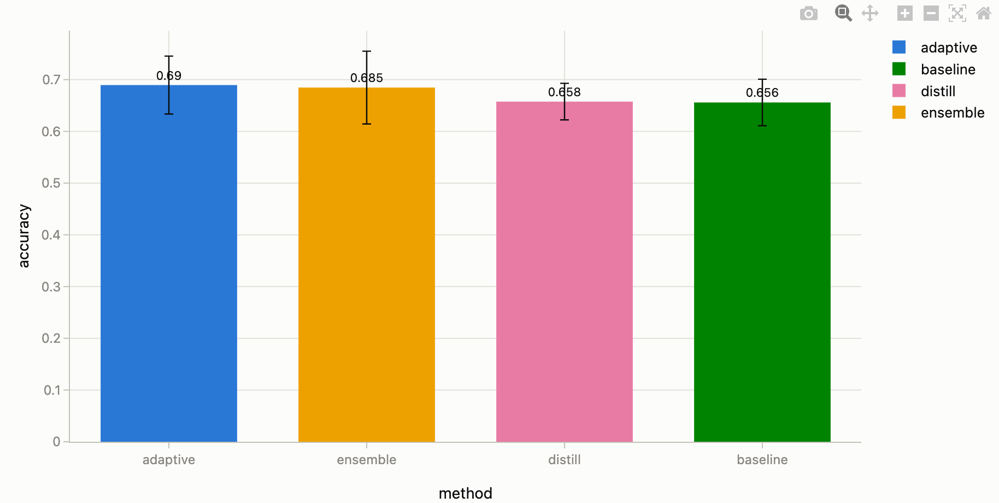

각 method의 버짓 6개 측정이 평균 하나로 요약되고, 수염(오차 막대)이 버짓에 따른 변동 폭을 보여줍니다.
**읽는 법**: 오차 막대가 서로 겹치면 "이 평균 차이는 조건에 따라 뒤집힐 수 있다"는 신호입니다.
seed 반복 실험이라면 `±표준오차`가 평균 자체의 신뢰도를 보여주므로 더 적합합니다.

### ② 버짓 스윕 추세 — "토큰을 늘리면 어디서 포화되는가?"

> 유형=`산점도+선`, X 축=`tokens`, Y 축=`accuracy`, 그룹(색상)=`method`
> 축 → X 스케일=`Log` · 고급 → 추세선=`로그 (a+b·ln x)`, 오차 밴드=`±1σ 음영`

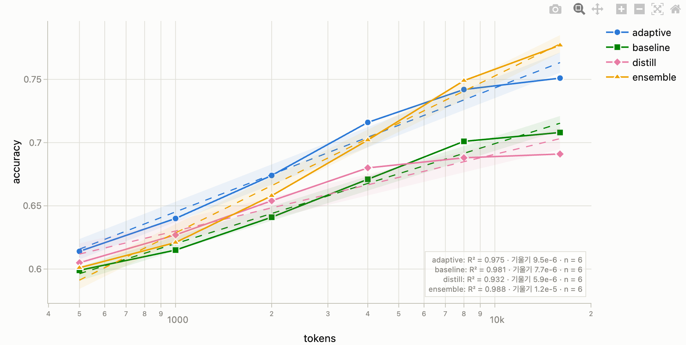

버짓이 2배씩 늘어나는 스윕은 로그 X축에서 등간격이 되어 추세가 곧게 펴집니다.
**읽는 법**: 곡선이 평평해지기 시작하는 지점이 "돈을 더 써도 이득이 없는" 포화점 — 텍스트 마커로 그 지점에 주석을 달면 메시지가 완성됩니다.

### ③ 속도–성능 트레이드오프 — "지연을 감수할 가치가 있는가?"

> 유형=`산점도`, X 축=`latency_ms`, Y 축=`accuracy`, 그룹(색상)=`method`
> 고급 → Pareto 체크, 방향=`X작을수록·Y클수록 좋음`
> 기준점(예: baseline의 운영 설정) **클릭** → `📍 베이스라인 추가` → 설정의 베이스라인 목록에서 음영=`좌상단`
> (데이터 점에 없는 값에 긋고 싶으면 설정 → 베이스라인의 `＋ 추가`에 x·y를 직접 넣으세요)

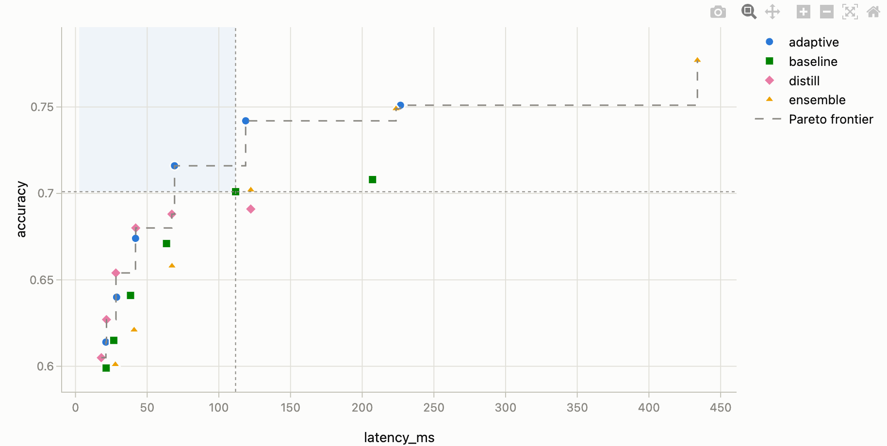

Pareto 계단선 위의 점만이 "합리적인 선택지"이고, 나머지는 지배당한 설정입니다. 점이 많아 구분이 어려우면 `지배당한 점 흐리게`를 켜세요 — 후보만 진하게 남고, 범례 견본이 옅은 방법은 프런티어에 하나도 올리지 못했다는 뜻입니다. 프런티어는 그룹과 무관하게 전체 점에서 계산하므로 여러 method가 섞여 나옵니다. `산점도+선`처럼 시리즈 선이 실선인 차트에서는 `선 모양`을 파선으로 바꾸면 프런티어와 구분됩니다. 색도 고를 수 있지만, 라이트·다크를 함께 쓴다면 비워 두어 테마를 따라가게 하는 편이 안전합니다.
베이스라인 음영(좌상단 = 더 빠르고 더 정확한 영역)에 들어온 점이 곧 "갈아탈 이유가 있는" 설정입니다.

### ④ 비용 내역 — "버짓별 총비용에서 누가 얼마를 차지하나?"

> 유형=`막대`, X 축=`tokens`, Y 축=`cost_usd`, 그룹(색상)=`method`
> 막대 옵션 → 배치=`쌓기 (스택)`, `X를 카테고리로` 체크

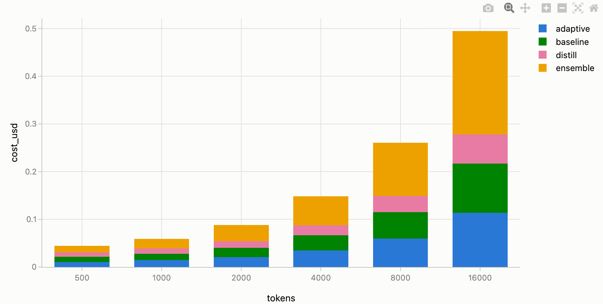

막대 전체 높이 = 총합, 색 구간 = 각 method의 기여분. `X를 카테고리로`를 켜야
500~16000이 등간격으로 나란히 그려집니다(끄면 실제 숫자 간격대로 배치되어 왼쪽 막대가 얇아짐).

**시간·스윕을 따라 구성비가 어떻게 변하는지**가 질문이라면 막대 대신 선으로 쌓으세요 —
유형=`선`, 설정 → 스타일 → 영역 채우기=`쌓기(누적 영역)`. 맨 위 경계선이 합계, 각 띠의 두께가 그 시리즈의 몫입니다.
(쌓기 중에는 WebGL 대신 SVG로 그립니다 — WebGL은 쌓기를 지원하지 않아 조용히 겹쳐 그려집니다.)

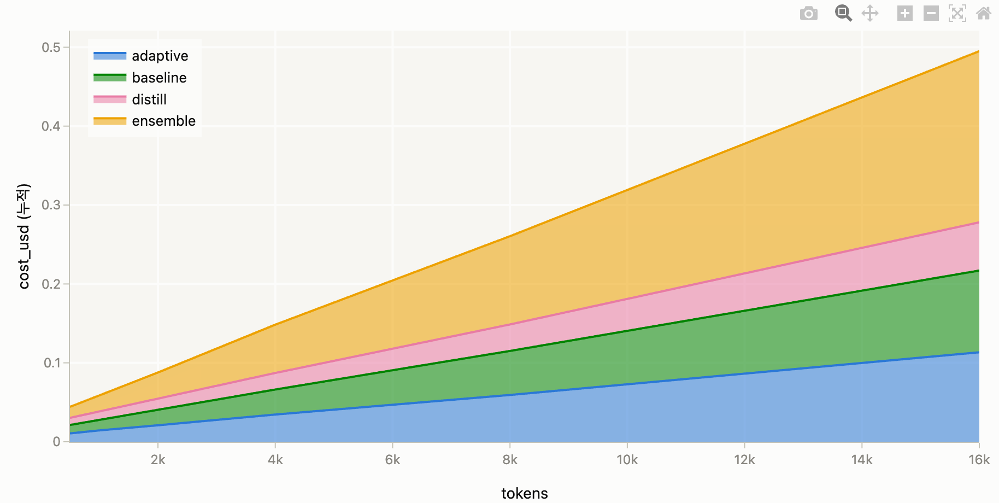

### ⑤ 랭킹 차트 — "처리량 순위를 한눈에"

> 유형=`막대`, X 축=`method`, Y 축=`throughput_fps`, 그룹(색상)=`method`
> 막대 옵션 → 방향=`가로`, 집계=`평균`, 정렬=`값 오름차순`, 값 표시=`막대 끝에 값`

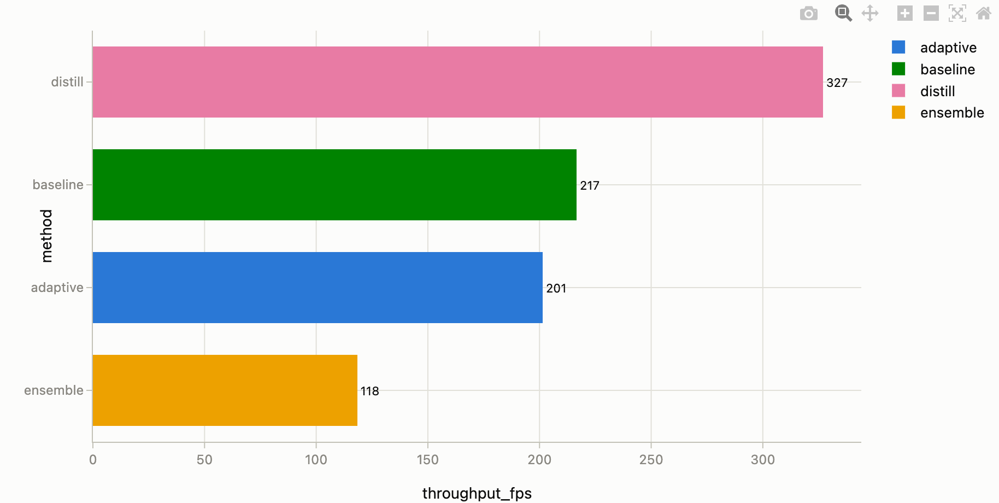

가로 막대는 항목 이름이 길거나 많을 때 레이블이 겹치지 않고, 정렬과 결합하면 순위표처럼 읽힙니다.
(가로에서는 위쪽이 1등이 되도록 `값 오름차순`을 씁니다.)

### ⑥ 세 번째 차원 함께 보기 — "색=method인 채로 frames 경향도 보고 싶다"

X=tokens, Y=accuracy, 그룹(색상)=method 상태에서:

1. **모양 그룹**=`frames` — 색은 method, 마커 모양은 frames (가장 권장, 범례에 조합별 표시)
2. **크기 컬럼**=`frames` — 값이 클수록 마커가 커짐 (연속값에 적합)
3. **연속 색상**=`frames` — 값에 따라 옅은→진한 색 그라데이션 + 컬러바. **주의: 그룹(색상)을 "(없음)"으로 비워야 켜집니다** (그룹 색과 동시 사용 불가). frames·비율처럼 카테고리가 아닌 연속 숫자를 색으로 볼 때 가장 좋음
4. **포인트 레이블**의 레이블 컬럼=`frames` — 각 점 옆에 값 표시
5. **분할(facet)**=`frames` — 설정 → 데이터 → 분할: frames 값마다 작은 차트로 자동 격자 배치 (예전처럼 복제+필터를 반복할 필요 없음)

2차 그룹의 고유값이 많으면(예: frames 6개 → 조합 24개) 범례가 폭발하니, **필터로 대비되는 2~3개 값만 남기고** 모양 그룹을 쓰세요:

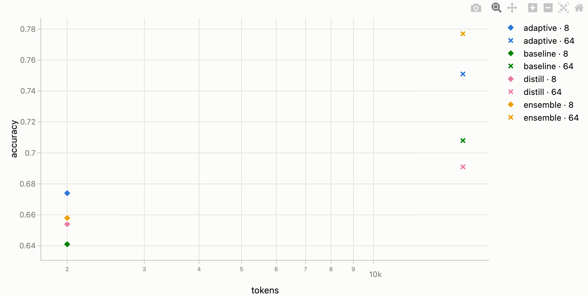

### ⑦ 발표용 마무리 — 차트를 "슬라이드 한 장"으로

- **제목이 결론을 말하게**: 스타일 → 제목에 "ensemble, 8k 토큰부터 baseline 추월" 처럼 발견 자체를 적으세요. "Accuracy vs Tokens"는 축 레이블이 이미 하는 말입니다.
- 핵심 포인트 **클릭** → `💬 텍스트 마커 추가`로 주석 (드래그로 위치 조정, 스타일은 포인트 레이블 그룹에서). 마커는 **그 점에 묶이므로** 다음 주 데이터로 갱신해도 같은 점을 가리킵니다
- 측정 조건·표본 수처럼 **어느 점에도 속하지 않는 문구**는 포인트 레이블 그룹의 `＋ 고정 메모`로 다세요 — 데이터나 축이 바뀌어도 자리를 지킵니다
- 스타일 → 글자 크기를 15–16으로 (발표장 뒷자리 기준), 범례는 시리즈가 2~3개면 `차트 안`으로 옮겨 공간 절약
- 내보내기는 `PNG`(3배 해상도, 슬라이드용) 또는 `SVG`(논문·벡터 편집용)
- **제출 규격이 정해져 있으면** 설정 → `내보내기 규격`에서 `논문 2단 (170mm)` 같은 프리셋을 고르세요. 안내에 저장될 픽셀과 본문 글자의 pt가 나오므로, 글자가 작으면 **dpi가 아니라 글자 크기**를 올려야 한다는 것도 그 자리에서 보입니다

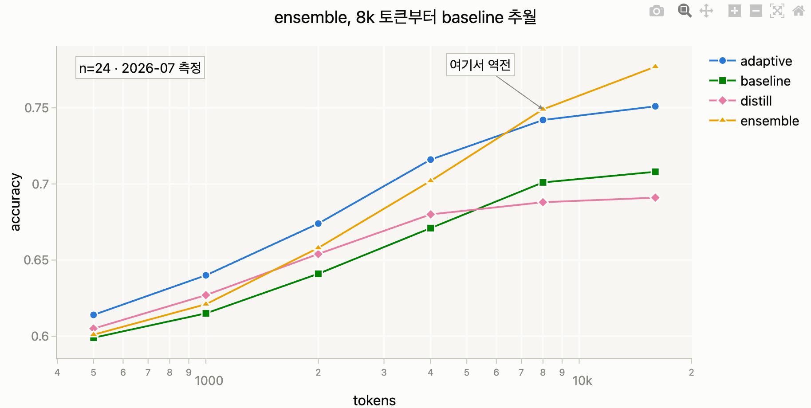

### ⑧ "대비" 값을 도구 안에서 만들기 — 계산 컬럼

"각 설정이 **기준 대비** 얼마나 좋은가"(예: baseline·dense 대비 정확도 차이)를 보고 싶은데 데이터에 그 컬럼이 없다면, 데이터를 다시 만들 필요 없이 **계산 컬럼**으로 즉석에서 만들 수 있습니다 (데이터 입력 아래 "계산 컬럼" 패널):

- **이항 연산**: 새 컬럼 = A [−, +, ×, ÷] B, 또는 **상수**와의 연산 (예: `used_tokens ÷ input_tokens` = 실제 사용 비율, `latency_ms ÷ 1000` = 초 단위). 어떤 단위가 읽기 좋은지는 데이터와 독자에 따라 다릅니다 — 원본을 바꾸지 않고 컬럼만 하나 더 만드는 것이니 둘 다 두고 골라 써도 됩니다.
- **정규화 / z-score**: 스케일이 다른 지표를 한 차트에서 비교할 때 (0~1, 최대값 대비 %, z-score). **그룹별** 기준도 선택 가능 — "method 안에서 상대적으로 얼마나 좋은가"
- **순위**: 그룹 안에서의 등수 (예: 각 버짓에서 method들의 순위)
- **구간화**: 연속값을 N개 구간으로 → 문자열이 되므로 그룹·필터·색으로 바로 쓸 수 있습니다
- **그룹 집계**: 그룹 평균/합을 각 행에 붙여, 기준 대비 델타와 조합하면 "그룹 평균 대비 이 행은 얼마나"를 계산할 수 있습니다
- **라벨 조합**: 계산이 아니라 **이름 붙이기** — 여러 컬럼의 값을 이어 붙여 문자열 컬럼을 만듭니다. 조각마다 앞뒤에 텍스트를, 사이에는 구분자를 넣을 수 있습니다 (예: `method` + `frames` → `baseline · 8frm`, `selector` + `frames` → `sal-v3.1 · 16frm`). **조건 조합 하나가 한 항목**이 되므로 막대 X축·그룹·분할에 그대로 얹어 "설정별로 한 줄씩" 비교하는 그림을 만들 수 있습니다. 정렬은 글자순이라 순서를 지정하고 싶으면 앞 텍스트에 `01_`처럼 붙이면 됩니다.
- **기준 대비 델타**: 매칭 키가 같은 기준 행 대비 **차이** 또는 **유지율%** (예: 값=`accuracy`, 기준=`method`가 `baseline`인 행, 매칭=`tokens` → "같은 토큰에서 baseline보다 몇 pt 높은가")

파생 컬럼을 다른 파생 컬럼의 입력으로 쓸 수 있고(이때 목록의 `↑`·`↓`로 **계산 순서**를 맞춰야 합니다), `✎`로 정의를 수정할 수 있습니다.
`×`로 지울 때 그 컬럼을 쓰는 차트가 있으면 먼저 알려주고, 지우면 해당 차트의 축·필터 설정도 함께 정리합니다.
만든 컬럼은 원본 파일을 바꾸지 않고 세션에 저장되며, 곧바로 축·필터로 쓸 수 있습니다. 프리셋에도 함께 담기므로 팀원에게 그대로 전달됩니다. 안 쓰면 패널을 접어두면 됩니다 — 화면에 영향 없습니다.

### ⑨ 2D 스윕 한 장으로 — 히트맵

> 유형=`히트맵`, X 축=`method`, Y 축=`tokens`, 색 값(컬럼)=`accuracy`, 집계=`평균`, `셀 값 표시` 체크

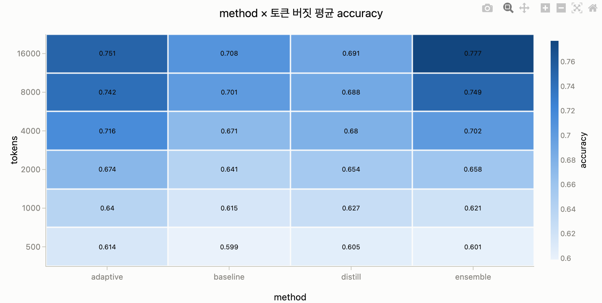

두 이산 축의 **모든 조합**을 한 장에 담습니다. 선 4개가 겹쳐 보이지 않을 때, 또는 "어느 칸이 비어 있는지"(측정 안 한 조합)를
드러내고 싶을 때 특히 좋습니다. **읽는 법**: 위로 갈수록 색이 더 진해지지 않는 지점이 곧 "더 늘려도 소용없는 구간"입니다.
색은 값의 크기만 나타내므로 **미세한 차이 비교에는 부적합**합니다 — 순위를 정확히 말해야 하면 막대로 가세요.

### ⑩ 두 조건의 격차 — 덤벨(짝 비교)

> 유형=`덤벨(짝 비교)`, 카테고리(X)=`method`, 값(Y)=`accuracy`, 짝 그룹=`tokens`
> 필터 → `tokens` 에서 `500`과 `16000`만 체크 (짝은 두 개일 때 가장 잘 읽힙니다)

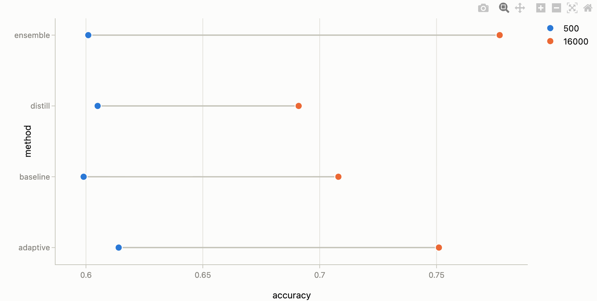

막대 두 개를 나란히 놓는 대신 **점 두 개와 연결선**으로 그려서, 항목별 "얼마나 벌었나"를 선 길이로 바로 읽게 합니다.
**읽는 법**: 선이 길수록 그 조건 변화의 효과가 큽니다. 시작점 위치(작은 버짓에서의 성능)와 이동 폭을 함께 볼 수 있는 것이 막대 대비 장점입니다.

### ⑪ 어디서 시작할지 모를 때 — `분석` 버튼

데이터를 막 받아서 무엇부터 그릴지 모르겠다면, 상단 `분석` 버튼을 누르세요. 도구가 데이터를 훑어
**데이터 문제 → 해석 주의 → 발견** 순으로 정리해 주고, 각 항목의 `＋ 차트`로 그 근거 차트를 바로 만들어 줍니다.

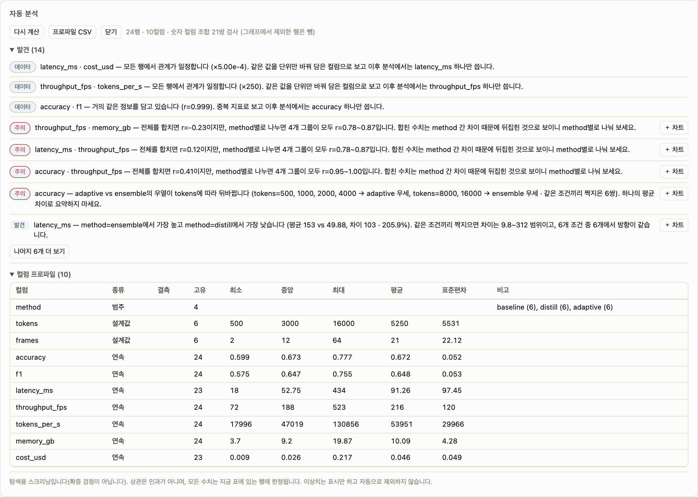

- **데이터**(회색) — 상수·빈 컬럼, 숫자에 섞인 문자(`OOM` 한 칸 때문에 컬럼 전체가 축 후보에서 빠지는 경우), 중복 행,
  특정 그룹에 몰린 결측, 측정 안 한 조합. **여기부터 고치세요.** 아래 내용이 전부 여기에 딸려 있습니다.
- **주의**(빨강) — 합쳐 보면 뒤집히는 관계(심슨 역설), 조건에 따라 우열이 바뀌는 교차. 잘못된 한 줄 요약을 막아주는 항목입니다.
- **발견**(회색) — 상관, 그룹 간 차이, 포화 지점, 이상치.

등급마다 **어떻게 확인하는지** 한 줄이 붙어 있습니다. 객관적으로 확인하기 쉬운 순서는 **데이터 → 주의 → 발견**입니다. 데이터 항목은 세면 나오는 사실이라 표에서 바로 검증되고, 주의 항목은 두 계산이 어긋난다는 보고라 차트 한 장으로 반증할 수 있으며, 발견 항목은 임계값 판단이 들어가므로 가장 마지막입니다. 그래서 발견에는 **그 차트 설정(유형·X·Y·그룹)이 회색 줄로 함께 적혀 있고**, `＋ 차트`를 누르면 그 설정의 차트로 갑니다 — 이미 같은 설정의 차트가 열려 있으면 새로 만들지 않고 `차트 보기`로 바뀌어 그리로 이동합니다.

#### 인사이트를 읽는 법 (그리고 무엇을 주장하면 안 되나)

- **상관은 인과가 아닙니다.** "A와 B가 함께 움직인다"는 말은 A가 B를 만든다는 뜻이 아닙니다. 논문·보고서에 옮길 때 인과 표현으로 바꾸지 마세요.
- **"주의" 항목이 있으면 그 아래 발견보다 먼저 처리하세요.** 예: 전체 상관이 −0.23인데 method별로는 모두 +0.8이라면,
  보고해야 할 값은 method별 값입니다. 합친 수치는 method들이 서로 다른 위치에 있어서 뒤집힌 것뿐입니다.
- **교차가 보고되면 평균 하나로 요약하지 마세요.** "A가 B보다 평균 +0.2%p 낫다"는 문장은 버짓 4000 이하에서만 참일 수 있습니다.
- **p값은 일부러 제공하지 않습니다.** 벤치마크 데이터는 행이 서로 독립이 아니고(같은 method의 버짓 스윕은 이어진 측정)
  반복 횟수도 임의적이라, 유의성 검정이 실제보다 후한 결론을 냅니다. 대신 **원단위 차이 + 조건별 방향 일관성**(예: "6개 조건 중 6개에서 같은 방향")을
  보여줍니다 — 이쪽이 재현될 발견인지 판단하는 데 더 쓸모 있습니다.
  그룹 차이에는 **부트스트랩 구간(95%)**이 함께 붙습니다. "측정 조건을 다시 뽑았다면 이 차이가 얼마나 흔들렸을까"를 뜻하며,
  구간이 0을 포함하면 아예 보고하지 않습니다. 유의성 판정이 아니라 흔들림 폭이라는 점에 주의하세요 — 예컨대 "차이 103, 구간 28~198"은
  방향은 분명하지만 크기는 조건에 크게 좌우된다는 뜻이고, "차이 10, 구간 9.98~10.02"는 조건과 무관하게 일정하다는 뜻입니다.
- **이상치는 표시만 하고 자동으로 지우지 않습니다.** 측정 오류일 수도, 진짜 현상일 수도 있으니 값을 확인한 뒤 표의 체크박스로 직접 제외하세요.
- **발견이 하나도 없는 것도 결과입니다.** 임계값을 넘지 못했다는 뜻이며, 억지로 낮춰 찾아낸 관계는 대개 재현되지 않습니다.

분석은 **표에 남아 있는 행**(그래프에서 제외한 행은 뺀 상태)에 대해 실행되고, 데이터를 바꾸면 결과를 버립니다. 세션에는 저장되지 않습니다.
발견이 하나도 없다면 패널 위쪽의 **검사 범위** 줄을 보세요 — 어떤 컬럼을 그룹·조건으로 봤고 무엇을 왜 제외했는지가 적혀 있어, "관계가 약해서"인지 "애초에 비교할 조건이 없어서"인지 구분할 수 있습니다.

### ⑫ 보고서로 내보내기 — 그림과 문장을 함께

차트를 다듬었다면 각 차트의 설정 → 스타일 → **캡션**에 "이 그림이 말하는 것"을 한두 문장으로 적고, 상단 `내보내기 ▾` → `리포트 MD`를 누르세요.
마크다운 파일 하나와 차트 PNG들이 함께 저장되며, 마크다운에는 차트마다 **캡션·차트 설정·적용된 필터 조건**이 적혀 있습니다.
분석을 실행한 상태라면 인사이트 요약과 해석 고지도 함께 들어갑니다.

**왜 필터 조건이 같이 나가야 하나**: "tokens ≤ 4000에서만 성립하는 결론"을 필터를 켠 채 캡처해 보고서에 넣고 조건을 적지 않으면,
읽는 사람은 전체 데이터의 결론으로 받아들입니다. 리포트는 그 조건을 자동으로 적어 줍니다.
인사이트를 문장으로 옮길 때는 **인과 표현으로 바꾸지 말고**(⑪의 "인사이트를 읽는 법" 참고), 필요한 부분만 골라 쓰세요.

**그림 옆에 숫자가 필요할 때** — 카드의 `표` 버튼을 누르면 그 차트가 쓰는 컬럼만, 그 차트의 필터를 적용한 행으로 표가 함께 나옵니다.
"저 점이 정확히 얼마인가"를 확인하는 자리이고, 화면을 읽을 수 없는 사람에게는 그래프를 읽는 유일한 길이기도 합니다.
표는 그림이 다시 그려질 때마다 같이 갱신되므로 둘이 어긋날 일이 없습니다.

### ⑬ 매주 갱신되는 로그로 계속 쓰기

같은 파일명으로 새 데이터를 넣으면 데이터만 바뀌고 차트 설정은 그대로 남습니다. v0.14부터는 **손으로 표시한 것도 남습니다** —
표에서 제외한 행, 흐리게 처리한 행, 드래그로 옮긴 포인트 레이블, 그리고 v0.15부터는 **텍스트 마커**가 그대로 이어집니다.
행을 알아보는 기준은 **조건 컬럼의 조합**(method·tokens 같은, 값이 몇 개뿐인 컬럼)이라 측정값이 갱신돼도 같은 행으로 인식합니다.
조건 자체가 바뀌면(예: 새 method 추가) 그 행은 새 행으로 봅니다.
마커가 가리키던 점이 없어지면 **엉뚱한 자리에 남기지 않고 숨긴 뒤 알려 줍니다** — 설정 → 포인트 레이블 목록에서 ⚠와 사유를 보고 `다시 지정`으로 다른 점에 붙이거나 지우면 됩니다.

서버로 폴더를 열어 두었다면 파일을 덮어쓰고 새로고침하는 것만으로 최신 값이 들어옵니다
(`python visualizer.py logs/`, 오프라인 파일로 쓰려면 `--offline`을 붙이세요).

**실험을 돌리는 중이라면** 화면의 `폴더 감시`를 켜 두세요(서버로 열었을 때만 나옵니다).
파일이 바뀌면 자동으로 다시 읽고, 위에 적은 대로 **손으로 표시한 제외·흐리게는 유지됩니다**.
파일이 잠깐 사라져도(쓰는 중·이름 바꾸는 중) 화면에서 지우지 않습니다 — 내가 지운 것도 아닌데 없어지면 되돌릴 길이 없기 때문입니다.

**파일을 여러 개 열었다면** — 차트 설정 맨 위 `데이터`에서 그릴 파일을 고르면 그 파일만 그립니다.
컬럼 목록도 그 파일 것만 남아서, 스키마가 다른 데이터를 함께 열어 두고 차트마다 다른 파일을 봐도 헷갈리지 않습니다.
반대로 **같은 스키마의 파일들을 비교**하고 싶다면 `(전체)`로 두고 분할=`_source`(파일별 작은 차트) 또는 그룹(색상)=`_source`(겹쳐 보기)가 낫습니다.

**컬럼이 계속 늘어난다면** — 로그에 컬럼이 20~40개씩 붙는 경우, 표의 `컬럼 n/m` 버튼에서 지금 안 쓰는 것을 꺼 두세요.
꺼진 컬럼은 표·축 선택·필터·자동 분석에서 한꺼번에 빠져 드롭다운이 다시 짧아집니다.
데이터는 그대로라 언제든 `모두 표시`로 되돌아오고, 그 컬럼으로 이미 그린 차트도 계속 그려집니다.
분석이 엉뚱한 컬럼을 물고 늘어질 때도 그 컬럼을 꺼 두면 스캔 대상에서 빠집니다.

### ⑱ 반복 측정의 분포 — 박스가 감추는 것

seed를 바꿔 여러 번 돌린 결과는 "평균 얼마"로 요약하면 절반을 잃습니다.
아래 세 그림은 **같은 데이터**(4 method × 30 seed)를 세 방식으로 그린 것입니다 —
데이터 카드의 `예시 더`를 누르면 들어오는 `seeds.csv`이므로 그대로 따라 해 볼 수 있습니다.

> 유형=`박스플롯`, Y 축=`accuracy`, 그룹(색상)=`method`, 데이터=`seeds.csv`

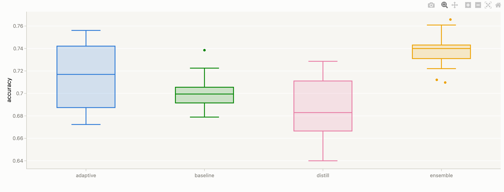

박스는 사분위수와 수염을 말합니다. `adaptive`는 상자가 넓고 `distill`도 넓어 보입니다 — **둘이 같은 이유로 넓은지는 알 수 없습니다.**

> 유형만 `바이올린`으로 바꿉니다

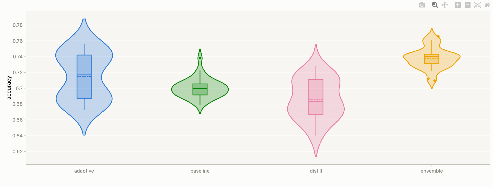

`adaptive`는 **봉우리가 둘**입니다. 설정이나 초기화에 따라 결과가 두 갈래로 갈린다는 뜻이고,
평균·중앙값·사분위수 어느 것으로도 볼 수 없는 사실입니다. `distill`은 진짜로 고르게 퍼진 것이고 `ensemble`은 좁습니다.
**상자와 평균선은 바이올린 안에 그대로 얹혀 있으므로** 요약을 잃지 않습니다.

> 유형을 `누적분포(ECDF)`로

**"몇 %가 이 값 이하인가"를 세로로 읽습니다.** 임계값이 정해져 있을 때(예: "0.72는 넘어야 배포") 가장 직접적인 그림입니다.
`adaptive`의 중간이 **평평한 것**이 이봉성의 다른 얼굴입니다 — 그 구간의 값이 아예 관측되지 않았다는 뜻입니다.
계단으로 그리는 이유도 같습니다: 직선으로 이으면 **관측되지 않은 값에 확률을 주는** 그림이 됩니다.

**언제 무엇을 쓰나** — 값이 method당 10개 미만이면 바이올린의 곡선은 실제보다 매끄러워 보이므로 박스나 점이 정직합니다.
임계값이 관심사면 ECDF, 분포 모양이 관심사면 바이올린, 여러 조건을 좁게 늘어놓아야 하면 박스입니다.

### ⑲ 값이 두 무리로 갈릴 때 — 축 끊기

같은 지표인데 자릿수가 다른 것을 한 그림에 넣어야 할 때가 있습니다(CPU와 GPU의 지연 시간, 소형과 대형 모델의 메모리).
한 축에 그리면 작은 쪽이 바닥에 붙어 **서로 구분조차 되지 않습니다.**
데이터 카드의 `예시 더`로 들어오는 `scales.csv`(3 백엔드 × 6 배치)로 그대로 따라 할 수 있습니다.

> 유형=`산점도+선`, X=`batch`, Y=`latency_ms`, 그룹(색상)=`backend`, 데이터=`scales.csv`

`cpu`만 읽히고 `gpu`·`gpu-int8`은 겹친 한 줄로 보입니다. 실제로는 둘의 차이가 30%나 되는데도요.

> 유형만 `축 끊기`로 바꿉니다 (끊을 구간은 비워 둡니다)

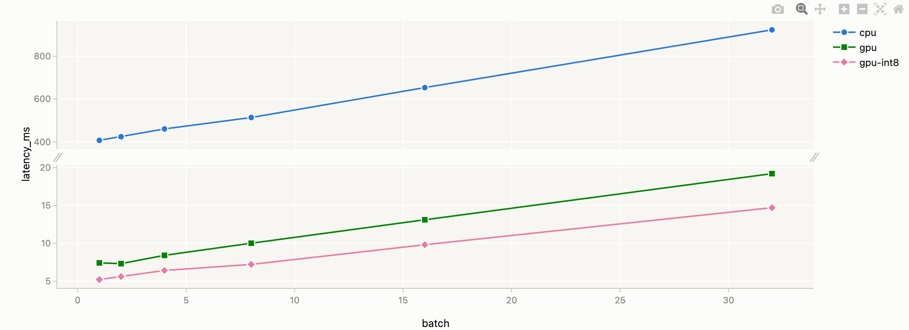

**축이 둘로 나뉘고 그 사이가 `⁄⁄`로 접혔습니다.** 두 무리가 각자의 범위를 차지하므로
`gpu`와 `gpu-int8`의 차이도, `cpu`의 증가 추세도 함께 읽힙니다.
**축 값은 진짜 값 그대로**입니다 — hover도, `표` 보기도, 내보낸 CSV·리포트도 접기 전 숫자를 말합니다.

- **구간은 비워 두면 자동**입니다. 가장 큰 빈 구간을 찾아 접되, 그 구간이 전체 범위의 25%를 넘고
  양쪽에 점이 둘 이상일 때만 접습니다. 접을 만한 것이 없으면 **보통 차트처럼 그리고 그렇다고 알려 줍니다.**
- 직접 정하려면 `끊을 구간`에 두 숫자를 넣습니다(예: `20` ~ `380`).
- X가 두 무리인 경우(예: 토큰 예산 500~2,000과 100,000)는 `끊을 축`을 `X축`으로 바꿉니다.
- 기준선·텍스트 마커·구간 음영은 **자기 값이 있는 쪽 패널**에 붙습니다. 경계를 넘는 음영은 두 조각으로 나뉩니다.

**언제 쓰지 말아야 하나** — 값이 **배수로** 벌어지는 것이면(1, 10, 100, 1000) 로그축이 정답입니다.
축 끊기는 두 무리가 각자 선형으로 읽혀야 할 때의 도구입니다.
그리고 **막대에는 쓰지 않습니다**(그래서 막대 유형에는 없습니다) — 막대는 길이가 곧 크기라
축을 끊으면 그림이 거짓말을 합니다. 지표가 서로 다른 둘이면 축 끊기가 아니라 **보조 Y축**이 맞습니다.

### ⑮ 가로로 펼쳐진 CSV를 받았을 때 — 녹이기

컬럼이 `baseline, ours, ablation`처럼 **가로로 놓인** 파일은 이 도구의 전제(한 행 = 한 측정점)와 맞지 않습니다.
축·그룹·필터가 모두 "컬럼 하나 = 한 가지 것"을 전제하기 때문에, 그대로는 method별로 색을 나눌 수가 없습니다.

예시로 해 보려면 데이터 카드의 `예시 더` 버튼을 누르세요 — `wide.csv`가 바로 이 모양입니다.

> 데이터 칩의 `⇲` → 녹일 컬럼에서 **조건 컬럼(tokens 등)은 체크를 풀고** 측정값만 남깁니다 → `녹여서 추가`

원본은 그대로 두고 `…-long.csv`가 새로 생깁니다. 만들어진 `항목` 컬럼이 곧 method이므로 그룹(색상)·분할·필터에 바로 씁니다.
**기본 추정은 자주 틀립니다** — 스윕 노브도 숫자라 "녹일 값"으로 잡히니, 조건 컬럼은 손으로 옮겨 주세요.
미리보기에 몇 행이 될지 나오므로 누르기 전에 확인할 수 있습니다.

### ⑯ 측정과 메타가 다른 파일에 있을 때 — 결합

`runs.csv`에 측정이 있고 `models.csv`에 모델 파라미터·가격이 있는 구성은 흔합니다.
파일을 둘 다 열어도 행이 이어 붙기만 하므로, 예전에는 "파라미터 수 대비 정확도"를 그릴 수 없었습니다.

예시로 해 보려면 `예시 더`를 누르고 `example.csv` + `methods.csv`로 아래를 그대로 따라 하세요(키는 `method`).

> 계산 컬럼 → 종류=`다른 파일에서 가져오기` → 가져올 파일=`models.csv`, 컬럼=`params_b`, 매칭 키=`model`

키 후보로는 **양쪽 파일에 다 있는 컬럼만** 나오고, 키를 고르는 즉시 **몇 행이 짝을 찾는지** 알려 줍니다 —
0행이면 키가 틀린 것이니 누르기 전에 압니다. 짝이 여럿이면 첫 값/평균/합/최소/최대/개수 중에 고릅니다.
**행은 늘어나지 않습니다**(컬럼만 붙습니다). 메타를 넷 붙이려면 정의를 넷 만드세요.

### ⑰ 제출 규격에 맞춘 그림 — 크기·오차·구간

화면에서 잘 보이는 것과 논문·보고서에 들어가서 잘 보이는 것은 다릅니다.

> 설정 → 내보내기 규격 → 규격=`논문 2단 (170mm)`, dpi=`300`
> 설정 → 데이터 → 오차 컬럼=`score_std` (± 값이 이미 컬럼으로 있을 때 — 예시는 `repeat.csv`의 `accuracy_std`)
> 설정 → 베이스라인 → `＋ 구간`으로 강조할 범위를 띠로

- **글자가 작으면 dpi가 아니라 글자 크기를 올리세요.** 안내에 결과 pt가 나옵니다 — dpi를 올려도 글자의 물리 크기는 그대로입니다.
- **오차막대는 집계할 때만 나오던 것**이라, 이미 계산된 `_std` 컬럼이 있으면 `오차 컬럼`으로 바로 그립니다(집계 중에는 무시됩니다).
- **구간 음영은 베이스라인이 못 하는 말**을 합니다 — 베이스라인이 "이 선"이라면 구간은 "이 범위"(권장 대역, 메모리 초과 구간 등)입니다.
- 마크다운 리포트에 들어가는 그림도 같은 규격을 따릅니다.

### ⑭ 색 고르기 — 어디에 낼 그림인가

상단의 색 선택에서 팔레트를 바꿀 수 있습니다. 넷 다 색약(적록·청황) 안전 검증을 통과했으니 **어느 것을 골라도 안전**하고, 선택 기준은 목적지입니다.

- **논문·학회** → `Okabe-Ito`. 리뷰어에게 익숙하고 흑백 인쇄에서도 구분이 남습니다.
- **사내 발표·대시보드** → `Carbon`. 채도가 높아 화면에서 또렷합니다.
- **텍스트 문서에 섞이는 그림** → `잉크 톤`. 조용해서 본문을 방해하지 않습니다.
- **그 외** → `기본`.

같은 팔레트를 팀이 함께 쓰면 문서 전체에서 method 색이 일정해집니다. 세션을 내보내면 팔레트 선택도 함께 담기지만, 받는 쪽이 이미 고른 값이 있으면 그 사람 선택을 존중합니다.

## 3. 효과적 전달 원칙 (요약)

1. **차트 하나에 메시지 하나** — 두 가지를 말하고 싶으면 차트를 복제해 두 장으로.
2. **강조는 희소해야 강조다** — 레이블·마커·음영은 주인공에만.
3. **색은 항목을 따라 고정** — 같은 method는 모든 차트에서 같은 색이어야 합니다. 도구가 자동으로 지켜주지만(필터를 걸어도 색 유지), 시리즈 색을 직접 바꿀 때도 이 원칙을 유지하세요.
4. **비교 기준을 그림 안에** — "좋다/나쁘다"는 베이스라인이 있어야 성립합니다. 기준점을 클릭하거나 설정 → 베이스라인에 값을 넣어 점선으로 박아두세요.
5. **불확실성을 숨기지 않기** — 반복 측정이 있다면 오차 막대/오차 밴드를 켜는 것이 정직한 그래프입니다.
6. **단위는 축 레이블에** — 컬럼명 규칙(`latency_ms`, `cost_usd`)이 그대로 축에 보이므로, 모호하면 축 → X/Y 레이블로 다듬으세요.

## 4. 팀과 공유하기

- **차트 설정째 공유**: 상단 `내보내기 ▾` → `세션 내보내기` → JSON 파일 하나에 데이터+차트 설정이 모두 담깁니다. 받은 사람은 `세션 가져오기`로 똑같은 화면을 복원합니다.
- **프리셋 vs 세션**: 세션 = 데이터+차트 전부, **프리셋 = 차트 설정만**(카드의 `프리셋` 버튼). 매주 갱신되는 실험 로그처럼 **데이터는 바뀌고 스키마는 같은** 경우, 프리셋을 저장해 두면 새 데이터에 클릭 한 번으로 같은 차트를 다시 그립니다.
- **데이터 변환**: 포맷이 무엇이든 README의 [에이전트 요청문](README.md#내-데이터를-이-포맷으로-변환하기-에이전트-요청문)을 LLM에 붙여넣으면 입력 계약에 맞는 CSV/JSON으로 변환됩니다.
- **오프라인 배포**: `index-offline.html` 파일 하나만 복사하면 인터넷 없는 곳에서도 동일하게 동작합니다.

---

© mrc

## 보고용 캡처에 표시 달기

그림 하나로 말이 안 끝날 때가 있습니다 — "이 지점에서 꺾입니다", "이 구간은 메모리 초과", "이 값은 가려 주세요".
데이터에 묶인 주석(텍스트 마커·구간 음영)은 본문에서 달고, **캡처 자체에 다는 표시**는 `내보내기 ▾ → 이미지 주석…`에서 합니다.

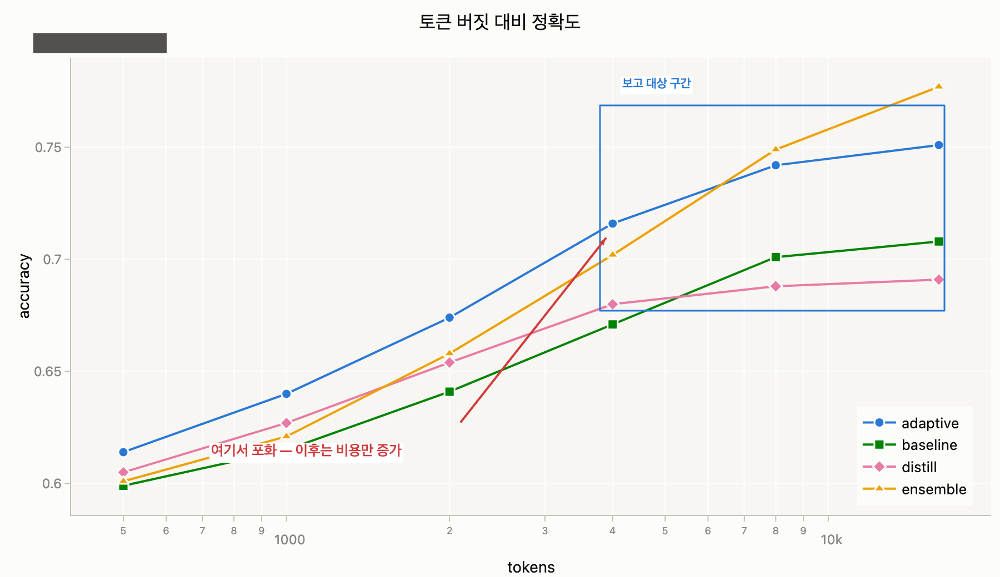

- 스크린샷은 **붙여넣기(⌘/Ctrl+V)**가 제일 빠릅니다. 차트 PNG를 저장해 드래그해도 됩니다.
- `화살표`로 한 점을 가리키고, `사각형`으로 영역을 묶고, `텍스트`로 한 줄 붙입니다.
- **`가리기`는 공유 전에 계정명·경로·금액을 덮는 용도**입니다. 불투명하게 덮으므로 아래가 비치지 않습니다.
- 저장은 원본 해상도 기준 1x/2x입니다 — 화면에서 줄여 보고 있어도 저장본은 작아지지 않습니다.

> 표시가 **데이터를 따라가야 한다면** 이 도구가 아니라 본문의 텍스트 마커를 쓰세요.
> 캡처 위의 표시는 그림에 박히므로, 데이터가 바뀌면 다시 찍어야 합니다.
