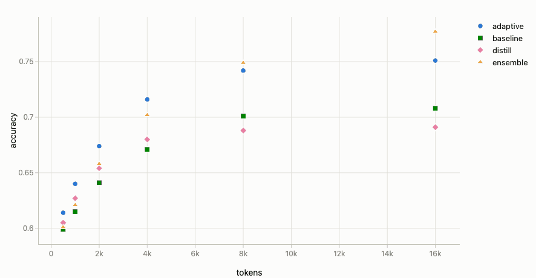
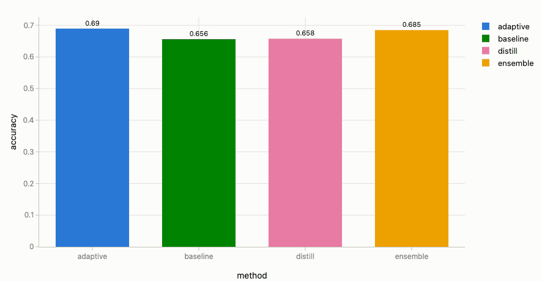
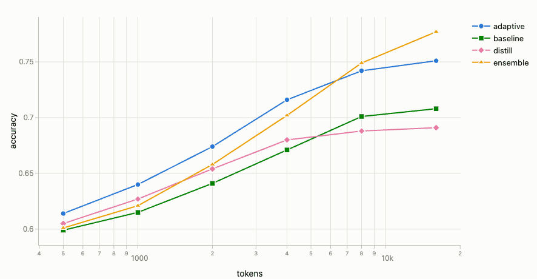
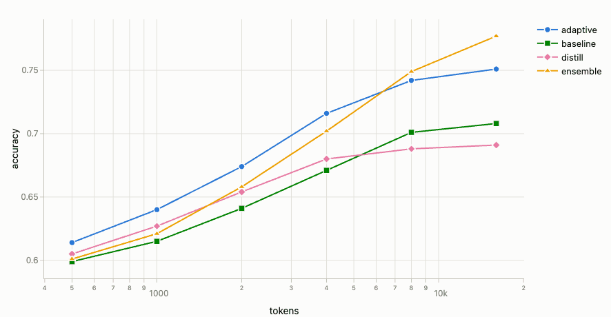

# VTC Visualizer

**English** | [한국어](README.md)

A general-purpose visualizer that turns CSV/JSON data into paper-style interactive charts, right in your browser.
Build fully customizable benchmark comparisons — performance vs. token budget, performance vs. speed, and so on.
All data is processed entirely in your browser and never sent anywhere.

> 📊 **Which chart, when, and how to make it land?** — see the **[Visualization Guide (GUIDE.en.md)](GUIDE.en.md)** for chart-choice criteria and per-scenario recipes.

## Preview

Every setting re-renders the chart live — hop between scatter, line and bar, and drop a trendline on top:



| Bar charts (mean · sort · horizontal · error bars) | Highlight by dimming (focus + context) | Small multiples (facet) |
|:---:|:---:|:---:|
|  |  |  |

## Quick start

Any of these three:

1. **Double-click** — open `index.html` in a browser and drag & drop your files (needs internet: the chart library loads from a CDN)
2. **Fully offline** — double-click `index-offline.html` (no internet needed; copy this single file anywhere)
3. **Folder autoload** — run the server pointing at a data folder:

   ```bash
   python visualizer.py .                 # first time? try the bundled example.csv
   python visualizer.py results/          # autoloads *.csv, *.json from results/
   python visualizer.py                   # start empty
   python visualizer.py results/ --port 8765
   ```

The UI is bilingual — use the **KO/EN toggle** in the top-right corner (your choice is remembered).

Try dragging in the bundled `example.csv` first — 24 rows sweeping 4 methods × token budgets (500–16k, no duplicates),
with common-sense trends baked in: accuracy rises with a saturating curve while latency and cost grow with tokens
(e.g. X=tokens, Y=accuracy, group=method gives clean curves with no filters).

## Adding data

- **Drag & drop** CSV/JSON files (multiple at once)
- **Open files… / Open folder…** buttons
- **Paste data…** button → paste CSV/JSON text
- When launched via `visualizer.py`, files in the given folder load automatically

Files keep merging as you add them. Re-adding the same filename replaces it.

## Data format (input contract)

- **CSV**: first line is the header, then one row = one measurement point. (TSV also works)
- **JSON**: an array of objects `[{"method": "ours", "tokens": 4000, "score": 0.744}, …]`
- **No required columns.** Numeric columns automatically become axis candidates; string columns become group (color) / filter candidates.
- Column names are free-form, and files may have different columns (merged as a union; missing cells show as `–`).
- With two or more files loaded, the source filename appears as a `_source` column usable for grouping/filtering (hidden with a single file).

Recommended shape (long-form / tidy — one measurement per row):

```csv
method,tokens,latency_s,score,dataset
baseline,1000,1.2,0.612,MMLU
baseline,4000,3.8,0.681,MMLU
ours,1000,1.4,0.641,MMLU
ours,4000,4.1,0.744,MMLU
```

## Features

| Feature | How |
|---|---|
| Add/duplicate/delete charts | `＋ Add chart` at the top, `Duplicate`/`Delete` on each card — multiple charts per page |
| **Chart controls** | drag = zoom to area · wheel = zoom · double-click = reset view · pan via the crosshair in the mode bar · `Reset view` button. Zoom survives style changes |
| Axes & scales | Settings → Axes: labels, linear/log toggle, min/max range (**either side alone is fine**), grid |
| Series styling | Settings → Style: per-series color, **editable legend name**, marker symbol/size, **line style (solid/dash/dot) and width**, font |
| Legend position | Settings → Style → Legend: right · top · **inside corner (top-left/top-right/bottom-left/bottom-right)** · hidden |
| Filters | Settings → Filters: pick a column → categorical columns get **value checkboxes (multi-select** — e.g. check just baseline & ensemble), numeric columns get comparisons (>, ≥, …) **or the "Select" operator for multi-select values**. Each filter runs in **Exclude** (drop non-matching rows) or **Dim** (fade non-matching rows into the background = rule-based highlight) mode |
| **Language (KO/EN)** | Toggle button in the top-right corner (persisted) |
| **Baselines** | **Click** a point → "Add baseline" → thin dashed h/v lines. **Multiple baselines**, each switchable between **crosshair / horizontal only / vertical only** (e.g. a horizontal 0-line for delta metrics), quadrant shading in crosshair mode, removable from the settings panel |
| **Text markers** | **Click** a point → "Add text marker" → an arrowed callout. Drag to move, click to edit/delete |
| **Exclude a point** | **Click** a point → "Exclude this point" → removed from every chart. Roll back via the toast's `Undo`, the table checkboxes, or `Restore all excluded` |
| **Trend lines** | Settings → Advanced: linear / quadratic / log / exponential / power / moving-average fits per series (dash & width adjustable), optional **error band (±1σ/±2σ)** shading |
| **Shape group (3rd dimension)** | Settings → Data → Shape group: color = group 1, **marker shape = group 2**. E.g. color=method, shape=frames keeps method colors while distinguishing frames by shape |
| Text marker styling | Global font size/color/background/arrow in the Point labels group; per-marker color/size override in the click-to-edit popup |
| Line smoothing | Settings → Style → line shape: straight/spline, solid/dash/dot |
| **Area fill** | Settings → Style → Area fill: soft pastel band under each line in the series color |
| **Bar charts** | Type → Bar: **grouped/stacked**, **vertical/horizontal**, **aggregation** of rows sharing the same X (mean · sum · median · min · max · count), **error bars (±std dev/±std error)** with mean, **value labels** at bar ends, name/value **sorting**, opacity, **treat numeric X as categories** (even spacing) — Settings → Bar options. E.g. X=method, Y=accuracy, aggregate=mean |
| Point labels | Settings → Point labels: **drag** to fine-tune positions, **click** to hide individually. Duplicates collapse to one; overlaps auto-avoid |
| Pareto frontier | Settings → Advanced: pick the "better" direction (e.g. lower X · higher Y) |
| **Facet (small multiples)** | Settings → Data → Facet: split into a small chart per column value, laid out in a grid (small multiples without duplicate+filter) |
| **Computed columns** | "Computed columns" below the data input: derive a new column — binary op (A−B, A/B, …) or **delta/retention vs a reference** (e.g. vs dense). Source file untouched; usable directly as axis/filter |
| **Continuous color** | Settings → Data → Continuous color: color by a numeric column as a gradient (colorbar) — mutually exclusive with group color, scatter/line only |
| **Point aggregate · error bars** | Settings → Advanced → Point aggregate: summarize points sharing the same X (e.g. seed repeats) by mean/median/… + **error bars (±σ/SE) · error band** |
| **Focus / de-emphasize** | **Click** a point → "De-emphasize (fade)" → not excluded, just receded into a light-gray backdrop (focus + context). Keeps only the highlighted points/lines prominent. Restore via toast/table |
| Export | `PNG` (3×) / `SVG` per card, `All charts PNG` (whole page in one image) in the top bar, `Export CSV` (current filtered data) in the table |
| Raw data | Bottom table: search, click-to-sort, per-dataset delete, **uncheck a row to exclude it from charts** |
| Sessions | Autosave (localStorage) + `Export/Import session` (JSON file) for sharing |
| **Chart presets** | `Presets` button on each card: save the current chart's **settings only** (no data) under a name → re-apply with one click to any data using the same column names. Share via JSON `Export/Import` |

### Tip: which chart, when?

Chart-choice criteria (trend → line, magnitude → bar, trade-off → scatter), per-scenario recipes (mean + error bars,
stacked, rankings, Pareto…), third-dimension techniques, and presentation polish are collected in the
**[Visualization Guide (GUIDE.en.md)](GUIDE.en.md)**.

## Converting your data to this format (agent prompt)

Whatever format your logs or experiment results are in, copy the prompt below into any LLM agent (Claude, etc.)
together with your data file (or its path):

```text
Convert my data into a CSV or JSON file that satisfies the "input contract" below.

[Input contract — VTC Visualizer]
1. CSV (header on the first line) or a JSON array of objects. UTF-8 encoded.
2. Long-form (tidy): one row = one measurement point. Repeat rows for repeated measurements.
   (e.g. scores per method × token budget become rows with 3 columns: method,tokens,score)
3. No required columns, but follow these guidelines:
   - Put the thing being compared (method/model/config name) in one string column (e.g. "method")
     → it becomes the color group in charts.
   - Put each measure used as an axis (token count, time, score, …) in its own numeric column.
     Encode units in the column name (e.g. latency_s, cost_usd).
   - Put each condition (dataset, GPU type, …) in its own column → usable as filters.
4. Numeric columns must contain numbers only (no unit strings, no thousands separators; leave missing values empty).
5. Prefer lowercase_with_underscores column names. The name "_source" is reserved — do not use it.

Save the result as *.csv or *.json. Ask me if any conversion rule is ambiguous.
```

If you convert often, consider writing your own conversion script targeting the same contract.

## Rebuilding the offline version

If you modify `index.html`, regenerate the offline build:

```bash
python visualizer.py build-offline    # → index-offline.html (~4.6MB)
```

## Requirements

- A modern browser (Chrome/Edge/Safari/Firefox)
- Python 3.8+ for `visualizer.py` (standard library only, nothing to install)

## Changelog

The version shows next to the title (top-right) and in the footer, matching the git tag (`v0.x`).

### v0.6 — dim filters
- **"Dim" filter mode**: instead of removing non-matching rows, fade them into the background → rule-based highlight (focus + context). Automates what used to be per-point de-emphasis.

### v0.5 — small multiples & computed columns
- **Facet (small multiples)**: split into a grid by column value — small multiples without repeated duplicate+filter.
- **Computed columns**: derive columns in-tool (binary ops, delta/retention vs a reference); source file untouched, saved in the session.

### v0.4 — analysis & reporting
- **Continuous color**: color by a numeric column as a gradient (colorbar).
- **Point aggregate · error bars · band**: summarize repeated measurements at the same X by mean, etc. (line/scatter).
- **Focus / de-emphasize (focus + context)**: fade points into the background instead of excluding them, to spotlight what matters.
- **Export**: all charts as one PNG; current filtered data as CSV.

### v0.3 — legend improvements
- Legend placement inside the chart by **corner** (top-left/top-right/bottom-left/bottom-right).
- **Editable legend names** (display only; internal identifiers unchanged).

### v0.2 — bar charts, guide, presets
- **Bar charts**: grouped/stacked, horizontal, aggregation (mean, etc.), error bars, value labels, sorting.
- **Visualization guide** (GUIDE.md/en) with example captures.
- **Chart presets**: save chart settings only → re-apply to new data.
- Baseline direction (crosshair/h/v), log-axis baseline placement fix, numeric multi-select filters, session-file-as-data guard, version badge.

### v0.1 — initial release
- Scatter/line/scatter+line, log axes, axis ranges, series styling, filters, baselines (quadrant shading), text markers, point labels, trendlines & error bands, Pareto, shape group, area fill, sessions, PNG/SVG, KO/EN, offline build, English docs.

---

© mrc
