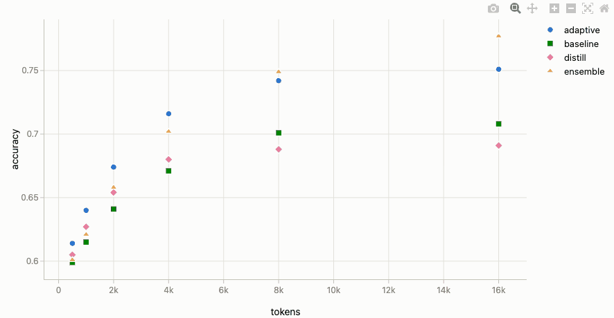
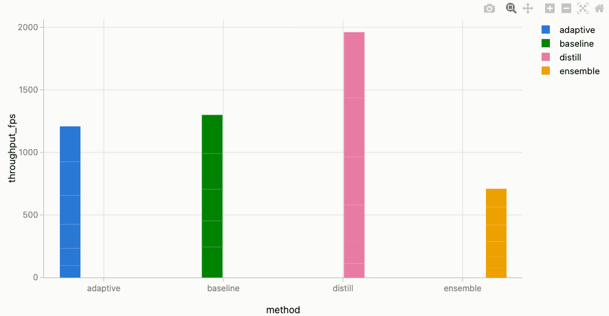
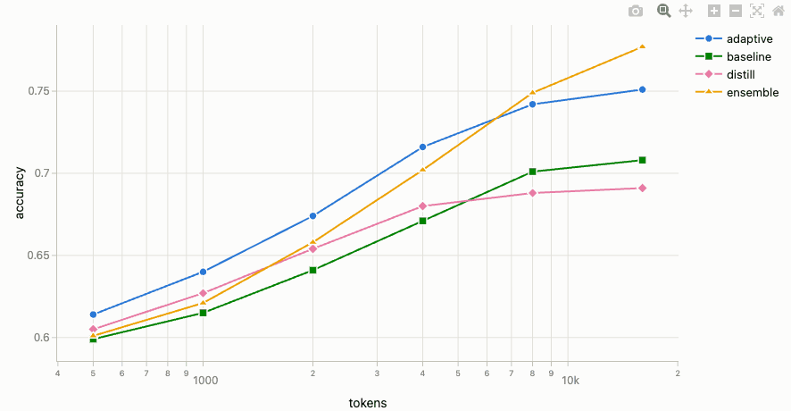
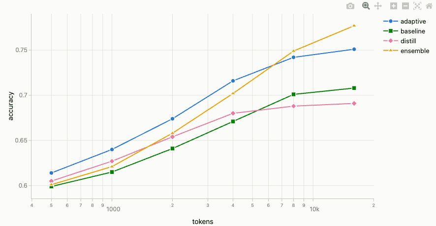

# VTC Visualizer

**English** | [한국어](README.md)

A general-purpose visualizer that turns CSV/JSON data into paper-style interactive charts, right in your browser.
Build fully customizable benchmark comparisons — performance vs. token budget, performance vs. speed, and so on.
All data is processed entirely in your browser and never sent anywhere.

> 📊 **Which chart, when, and how to make it land?** — see the **[Visualization Guide (GUIDE.en.md)](GUIDE.en.md)** for chart-choice criteria and per-scenario recipes.

## Preview

Every setting re-renders the chart live — hop between scatter, line and bar, and drop a trendline on top:



| Bar charts (mean · sort · horizontal · error bars) | Highlight by dimming (focus + context) | Small multiples (facet) |
|:---:|:---:|:---:|
|  |  |  |

## Quick start

Any of these three:

1. **Double-click** — open `index.html` in a browser and drag & drop your files (needs internet: the chart library loads from a CDN)
2. **Fully offline** — double-click `index-offline.html` (no internet needed; copy this single file anywhere)
3. **Folder autoload** — run the server pointing at a data folder:

   ```bash
   python visualizer.py .                 # first time? try the bundled example.csv
   python visualizer.py results/          # autoloads *.csv, *.json from results/
   python visualizer.py                   # start empty
   python visualizer.py results/ --port 8765
   python visualizer.py results/ --host 0.0.0.0   # reach it from another machine (exposes the folder)
   ```

   Tick `Watch folder` on the page and changes to those files load by themselves.

   Subfolders are included too (they show up as relative paths like `sub/run1.csv`).
   Hidden folders (`.git`, `.venv`, …) and symlinks pointing outside the folder are skipped, and the list stops at 500 files.

The UI is bilingual — use the **KO/EN toggle** in the top-right corner (your choice is remembered).

Try dragging in the bundled `example.csv` first — 24 rows sweeping 4 methods × token budgets (500–16k, no duplicates),
with common-sense trends baked in: accuracy rises with a saturating curve while latency and cost grow with tokens
(e.g. X=tokens, Y=accuracy, group=method gives clean curves with no filters).

## Your first chart takes about five minutes

1. Open `index.html` and drop a CSV onto the window. No file at hand? Click `Example`.
2. A `Try one of these:` row appears on the data card. It only lists recipes that actually draw with your columns, so pick any of them — the first chart appears right there.
3. Not what you wanted? Hit `Undo` in the toast and try another one.
4. Open `⚙ Settings` on the chart card to change the X axis, Y axis or grouping. You see the sixteen rows people use most; the rest sit behind `Show more advanced settings`.
5. When it looks right, use `PNG` or `SVG` on the card. If you have a submission spec, pick something like `Paper, 2 columns (170mm)` under Settings → Export size first.

For what to do next, the [visualization guide](GUIDE.en.md) has recipes organised by question — "which method is best?", "where does adding tokens stop helping?" — with the exact settings for each.

## Adding data

- **Drag & drop** CSV/JSON files (multiple at once)
- **Open files… / Open folder…** buttons
- **Paste** — ⌘/Ctrl+V anywhere on the page, or the **Paste data…** button. Before adding, it shows how many rows and columns it read and which delimiter it used
- When launched via `visualizer.py`, files in the given folder load automatically

Files keep merging as you add them. Re-adding the same filename replaces it.

## Data format (input contract)

- **CSV**: first line is the header, then one row = one measurement point. The delimiter is detected among **comma, tab, semicolon and pipe** (whichever makes the body match the header's column count).
- **JSON**: an array of objects `[{"method": "ours", "tokens": 4000, "score": 0.744}, …]`
- **No required columns.** Numeric columns automatically become axis candidates; string columns become group (color) / filter candidates.
- Column names are free-form, and files may have different columns (merged as a union; missing cells show as `–`).
- With two or more files loaded, the source filename appears as a `_source` column usable for grouping/filtering (hidden with a single file).

**How numbers are read** — the guess is made **per column**, never per cell. The `ⓘ` on a dataset chip shows how that file was read.

| Input | How it is read |
|---|---|
| `1,234.5` / `1.234,5` | If the whole column is one format, that format (US / European). If they are mixed the column stays text — picking either one would make half the values wrong |
| `N/A` · `NaN` · `-` · `null` · `inf` | Treated as missing only when the rest of the column is numeric (a `-` in a text column may be a real value) |
| `007` · integers of 16+ digits | Kept as text — converting them loses the leading zero or the last digits, irreversibly |
| `2024-01-05` | Text (a category). There is no time axis yet |
| Duplicate / empty headers | Not dropped — renamed to `name (2)` / `column 3` |
| A `"` mid-field | A literal character. Only a `"` as the first character of a field opens a quoted field (RFC4180) |
| Columns starting with `_` (`_id`) | Renamed on load (`id`, or `id_2` if taken). `_` is the tool's own namespace (`_source`, `_excluded`, `_muted`); left alone the column vanishes from the UI, and a column literally named `_excluded` would drop those rows from every chart |
| A column with the same name as a computed column | The file wins — the computed column is renamed to `name (calc)`, and every axis, filter, dependent definition, hidden-column entry and annotation anchor follows. A computed column can always be rebuilt from its definition; the file's values cannot |

Recommended shape (long-form / tidy — one measurement per row):

```csv
method,tokens,latency_s,score,dataset
baseline,1000,1.2,0.612,MMLU
baseline,4000,3.8,0.681,MMLU
ours,1000,1.4,0.641,MMLU
ours,4000,4.1,0.744,MMLU
```

## Features

### Getting data in

| Feature | How |
|---|---|
| **Collapsible data card** | The `▾` in the data-input header folds the card to a single line once your files are loaded (245 → 52px). Dropping files still works while collapsed, and a one-line summary keeps showing what is loaded |
| **Paste preview** | ⌘/Ctrl+V anywhere opens the paste box (it is not intercepted inside an input). Before you press `Add` it shows `24 rows × 5 columns — method, tokens, …` plus anything notable about the reading (semicolons, European decimals), and says when the name matches an existing dataset. A file it cannot read is reported in place, with your text left untouched |
| **Recipe chips** | Loading data adds a `Try one of these:` row to the data card — only recipes that actually draw with the current columns, and clicking one applies it to the first chart (no new cards) |
| **Example data** | `Load example data` brings the 24-row basic set; `More examples` adds five companions (metadata, a wide CSV, standard deviations, repeated seeds, two backends orders of magnitude apart) so guide recipes ⑮⑯⑰⑱⑲ can be followed as written |
| **Melt (wide → long)** | The `⇲` button on a dataset chip: turns a file whose columns are spread sideways (`baseline, ours, ablation`) into one row per measurement as a new dataset. The original is untouched, and the new name column works as a group/facet/filter straight away |
| **Watch folder** | The `Watch folder` checkbox, shown when running via `visualizer.py`: reloads files as they change. Leave it on while a run is in progress — exclusions and fading survive, and a file that briefly disappears is not dropped from the screen |
| **Join across files** | Computed columns → kind `Look up from another file`: finds a value in another file by key and attaches it as one column (e.g. `params_b` from `methods.csv` onto `example.csv`). Only columns present in both files are offered as keys, and picking one immediately tells you how many rows will find a match. Several matches fold via first/mean/sum/min/max/count. Rows are never multiplied |
| **Computed columns** | "Computed columns" below the data input: derive a new column — binary op (A−B, A/B, …) or delta/retention vs a reference (e.g. vs dense). Source file untouched; usable directly as axis/filter |
| **Label-join column** | Computed columns → kind `Label join`: instead of computing a value, it joins values from several columns into a text column, with per-part prefix/suffix text and a separator between them (e.g. `method` + `frames` → `baseline · 8frm`). The result works straight away as a group, facet, filter or bar X axis |
| **Hide columns** | The table's `Columns n/m` button: unchecking one drops it from the table, axis pickers, filters and the analysis at once. The data is untouched and existing charts keep drawing (references are never cleared). For logs with 20-40 columns — `In use only` keeps just what the charts reference, `Show all` puts everything back |
| Raw data | Bottom table: search, click-to-sort (or Enter on the header), per-dataset delete, uncheck a row to exclude it from charts, `Fade` column to de-emphasise it. Numeric columns are right-aligned so digits line up |
| **Per-chart data** | With two or more files loaded, each chart's settings start with a `Data` dropdown. Pick a file and the chart draws only that file's rows, with the axis, group and filter lists narrowed to the columns that file actually has. Different charts can point at different files, so unrelated datasets sit side by side (`(all)` merges them again) |
| Filters | Settings → Filters: pick a column → categorical columns get value checkboxes (multi-select — e.g. check just baseline & ensemble), numeric columns get comparisons (>, ≥, …) or the "Select" operator for multi-select values. Each filter runs in Exclude (drop non-matching rows) or Dim (fade non-matching rows into the background = rule-based highlight) mode |
| Copy filters | Settings → Filters → `Copy these filters to…` — apply the same conditions to one or all charts |
| **Exclude a point** | Click a point → "Exclude this point" → removed from every chart. Roll back via the toast's `Undo`, the table checkboxes, or `Restore all excluded` |
| **Focus / de-emphasize** | Click a point → "De-emphasize (fade)" → not excluded, just receded into a light-gray backdrop (focus + context). Keeps only the highlighted points/lines prominent. Restore via toast/table. Style → `Dimmed color` can keep the series color at low opacity instead of gray |
| **Automatic analysis** | `Analyze` in the top bar → a column profile (kind, missing, quantiles) plus findings ordered data problems → interpretation cautions → findings. Each tier carries a one-line note on how to verify it, and `＋ Chart` (or `Go to chart` when one already matches) opens the supporting chart. Findings also print their chart recipe (type · X · Y · group) so they are easy to line up against a chart. Duplicate columns, Simpson's paradox and crossovers are filtered out, and instead of p-values you get raw differences with direction consistency |

### Drawing the chart

| Feature | How |
|---|---|
| Add/duplicate/delete charts | `＋ Add chart` at the top, `Duplicate`/`Delete` on each card (undo from the toast) — multiple charts per page |
| **Chart types** | scatter · line · scatter+line · bar · heatmap (2D grid by color) · dumbbell (paired per category) · histogram · box plot (distributions) · violin (the shape, not just the quartiles) · ECDF (what fraction sits at or below a value) · broken axis (fold away the gap when values split into two far-apart groups — axis values stay real) |
| Axes & scales | Settings → Axes: labels, linear/log toggle, min/max range (either side alone is fine), grid |
| **Axis tick format** | Settings → Axis → X/Y tick format: auto · percent · thousands · scientific · fixed decimals (0–3) |
| **Second Y axis** | Settings → Data → Second Y axis: two metrics on different scales in one chart (right axis, dotted line, × markers) |
| **Aggregate** | Settings → Data → Aggregate: fold the rows that share an X (or a heatmap cell) into one point by mean, median, sum… One row, whatever the chart type |
| **Error** | Settings → Data → Error: `none / <column> / std dev / std error`. A precomputed ± column (e.g. `score_std`) is drawn as-is, and with a mean aggregate you can pick σ/SE instead (σ around a median, min or max is not that point's spread, so it is not offered). The column is ignored while aggregating. The ±kσ band lives in Settings → Advanced |
| **Bar charts** | Type → Bar: grouped/stacked, vertical/horizontal, aggregation of rows sharing the same X (mean · sum · median · min · max · count), error bars (±std dev/±std error) with mean, value labels at bar ends, name/value sorting, opacity, treat numeric X as categories (even spacing) — Settings → Bar options (aggregate and error live in Data). E.g. X=method, Y=accuracy, aggregate=mean |
| **Facet (small multiples)** | Settings → Data → Facet: split into a small chart per column value, laid out in a grid (small multiples without duplicate+filter) |
| **Shape group (3rd dimension)** | Settings → Data → Shape group: color = group 1, marker shape = group 2. E.g. color=method, shape=frames keeps method colors while distinguishing frames by shape |
| **Continuous color** | Settings → Data → Continuous color: color by a numeric column as a gradient (colorbar) — mutually exclusive with group color, scatter/line only |
| **Trend lines** | Settings → Advanced: linear / quadratic / log / exponential / power / moving-average fits per series (dash & width adjustable), optional error band (±1σ/±2σ) shading |
| Pareto frontier | Settings → Advanced: pick the "better" direction (e.g. lower X · higher Y) |
| **Mark best** | Settings → Point labels → Mark best: labels the highest or lowest Y automatically (one overall, or one per series). It is re-picked from the current data on every draw, so it moves when the data changes — unlike a hand-placed text marker |
| **Stacked area** | Settings → Style → Area fill → `Stack`: stacks the series so the total and each share read together (line types only) |
| Area fill | Settings → Style → Area fill: a soft pastel band under each line in the series colour. Can also be set per series (leave it empty to follow the chart) |
| Line smoothing | Settings → Style → line shape: straight/spline, solid/dash/dot |
| Series styling | Settings → Style: per-series color, editable legend name, marker symbol/size, line style and width, display mode (points / line / points + line), and reorder with ↑↓ — the legend and draw order change while the colour stays with the series |

### Making it readable

| Feature | How |
|---|---|
| **Chart palette** | Top-bar picker: Default · Carbon · Okabe-Ito · Ink — all validated colorblind-safe, with separate light/dark steps |
| **Dark mode** | 🌙/☀️ button (top-right) toggles light↔dark. Follows the OS setting first, then remembers your choice; charts adapt to the theme |
| Legend position | Settings → Style → Legend: right · top · inside corner (top-left/top-right/bottom-left/bottom-right) · hidden |
| **Chart size & layout** | Settings → Style → Chart size: height slider + full/half width (half places two charts side by side). A top-bar width toggle (normal/wide/full) sets the whole page width The settings panel width (narrow/default/wide/widest) is picked above the panel and applies to every chart. The panel height follows the window, and `One at a time` keeps a single group open (the series list starts folded) |
| Reorder & collapse cards | `↑`/`↓` in the card header reorder, `▾` folds the card down to a single header line. The folded state is saved in the session, and `Collapse all` folds every card at once. Zoom and settings-panel state survive adding charts or switching language |
| **Card summary** | With the settings collapsed, the header shows `type · X × Y · group · filter count · dataset` on one line |
| **Essentials ⇄ everything** | The `Essentials` checkbox above the panel (on by default): 16 frequently-used rows stay, the rest fold away (46 total). Anything you have set stays visible, and `Show N more advanced settings` at the bottom opens them all |
| **Option search** | Type an option name in the search box above the settings panel to filter it down. Hidden advanced rows are searchable too |
| **Chart controls** | drag = zoom to area · wheel = zoom · double-click = reset view · pan via the crosshair in the mode bar · `Reset view` button. Zoom survives style changes |
| **Rendering speed** | Settings → Style → Rendering: `Auto` (WebGL above 5,000 points) / `High quality (SVG)` / `Fast (WebGL)`. SVG export stays vector even in WebGL mode |
| **Language (KO/EN)** | Toggle button in the top-right corner (persisted) |
| **Card shortcuts** | With focus inside a card: `Alt+↑`/`Alt+↓` reorder, `Alt+←`/`Alt+→` collapse/expand. Arrows only, so nothing collides with typing |
| **Keyboard & accessibility** | Usable without a mouse: a skip-to-charts link on the first Tab, a real label on every settings control, popovers and the modal move focus inside on open and back to the opening button on Escape (Tab cannot leak out of the modal), table headers sort on Enter. Fade — previously point-click only — has a table column, and baselines can be added by value from the settings panel |

### Baselines and annotations

| Feature | How |
|---|---|
| **Baselines** | Click a point → "Add baseline" → thin dashed h/v lines. Multiple baselines, each switchable between crosshair / horizontal only / vertical only (pick the direction first in the add form and the unused box locks), a name drawn on the chart, shading by quadrant (crosshair) or above/below (horizontal) or left/right (vertical), plus a shade color (empty = automatic), removable from the settings panel, and it is anchored to that point (row) so it follows the new value when data is refreshed (baselines typed in as values stay pinned to the value). If the anchor point disappears it is not drawn in the wrong place — a ⚠ appears and you can `Re-anchor` it |
| **Span shading** | Settings → Baselines → `＋ Span`: paints a range on one axis with a label and a color (a recommended band, an out-of-memory region…). If a baseline is "one line", this is "this range" |
| **Text markers** | Click a point → "Add text marker" → an arrowed callout. Drag to move, click to edit/delete. Each marker is anchored to that point (row), so it follows the new value when the data is refreshed. `＋ Text marker` under Settings → Point labels builds one by picking a row instead (no mouse needed) |
| **Pinned notes** | Settings → Point labels → `＋ Pinned note`: a note tied to no data point, parked in a corner of the chart (`n=24 · measured 2026-07`). It stays put when the data or axes change, and can be dragged anywhere |
| **Lost-anchor warning** | If the anchor row disappears (filter, exclusion, deletion) or the axis column changes, the marker is hidden rather than drawn in the wrong place, and you're told. The settings list keeps it with a ⚠ and a reason, plus `Re-anchor` to attach it to another point |
| Point labels | Settings → Point labels: drag to fine-tune positions, click to hide individually. Duplicates collapse to one; overlaps auto-avoid |
| Text marker styling | Global font size/color/background/arrow in the Point labels group; per-marker color/size override in the click-to-edit popup |
| **Annotate an image** | `Export ▾` → `Annotate an image…`: a separate page (`annotate.html`) for putting text, arrows, boxes and redactions on a capture and saving it as PNG. Paste a screenshot straight in (⌘/Ctrl+V). The image never leaves the browser. It is a separate file, so keep it next to `index.html` |

### Exporting and picking up where you left off

| Feature | How |
|---|---|
| **Several figures on one sheet** | `Export ▾` → `Several figures on one sheet…`: lays the selected charts on a 1–4 column grid and saves one PNG, with panel labels `(a) (b) (c)` and a sheet width in mm/inch at a chosen dpi. Each panel keeps its own aspect ratio, so tick spacing is never distorted |
| Export | `PNG` (3×) / `SVG` per card, `All charts PNG` (whole page in one image) in the top-bar `Export ▾` menu, `Export CSV` (current filtered data) in the table |
| **Export size** | Settings → Export size: presets for paper 1-column (85mm), 2-column (170mm) and slides, or mm/inch directly, plus dpi. The hint shows the pixels it will save and the pt size of body text (raising dpi does not change the physical text size — raise the font size for that). Report figures follow the same spec |
| **Chart as table** | The card's `Table` button: shows the chart's own columns and filtered rows as a table. The only way to read the chart without seeing it, and handy for checking exact values |
| **Share as one HTML file** | `Export ▾` → `Share as one HTML file`: writes the current data and every chart setting into a single file. The recipient just double-clicks it — no tool, no session file. Build it from `index-offline.html` and it opens without internet too |
| Sessions | Autosave (localStorage) + `Export/Import session` (JSON file, in the `Export ▾` menu) for sharing. If the data is too large to store, a `Not saving` button stays in the top bar (click it to export the session to a file) and the next time you open the app it tells you the restored session predates those changes |
| **Built-in presets** | Top of the card's `Preset` button: average per item (bar), sweep trend (line), trade-off (Pareto), two-condition grid (heatmap), value distribution (box). They assume no column names — roles (category, sweep knob, score, cost) are matched against your current data by value distribution, so domain abbreviations work and identifier/seed columns are never used as axes, and a recipe whose roles cannot be filled is simply not listed |
| **Copy the look to other charts** | Settings → Style → `Copy this look to…`: font, text size/color, legend, size, grid, plot face, tick format and export spec in one go (with undo). Settings that point at data (axes, group, filters) are never copied |
| **Chart presets** | `Presets` button on each card: save the current chart's settings only (no data) under a name → re-apply with one click to any data using the same column names. Share via JSON `Export/Import` |

### Tip: which chart, when?
Chart-choice criteria (trend → line, magnitude → bar, trade-off → scatter), per-scenario recipes (mean + error bars,
stacked, rankings, Pareto…), third-dimension techniques, and presentation polish are collected in the
**[Visualization Guide (GUIDE.en.md)](GUIDE.en.md)**.

## Converting your data to this format (agent prompt)

Whatever format your logs or experiment results are in, copy the prompt below into any LLM agent (Claude, etc.)
together with your data file (or its path):

```text
Convert my data into a CSV or JSON file that satisfies the "input contract" below.

[Input contract — VTC Visualizer]
1. CSV (header on the first line) or a JSON array of objects. UTF-8 encoded.
2. Long-form (tidy): one row = one measurement point. Repeat rows for repeated measurements.
   (e.g. scores per method × token budget become rows with 3 columns: method,tokens,score)
3. No required columns, but follow these guidelines:
   - Put the thing being compared (method/model/config name) in one string column (e.g. "method")
     → it becomes the color group in charts.
   - Put each measure used as an axis (token count, time, score, …) in its own numeric column.
     Encode units in the column name (e.g. latency_s, cost_usd).
   - Put each condition (dataset, GPU type, …) in its own column → usable as filters.
4. Numeric columns must contain numbers only (no unit strings, no thousands separators; leave missing values empty).
5. Prefer lowercase_with_underscores column names. The name "_source" is reserved — do not use it.

Save the result as *.csv or *.json. Ask me if any conversion rule is ambiguous.
```

If you convert often, consider writing your own conversion script targeting the same contract.

## Rebuilding the offline version

If you modify `index.html`, regenerate the offline build:

```bash
python visualizer.py build-offline    # → index-offline.html (about 4.8MB)
```

## Known limits (left this way on purpose)

Things that could be fixed but did not look worth it. Writing down the reason beats making the same call again later.

- **Analysis takes a while** — about 3 s on 50k rows with 20 continuous columns. The obvious target (regrouping rows per correlation pair) was precomputed as an experiment and only bought **10%** (3,177 → 2,865 ms) while adding a subtle ordering invariant, so it was reverted. A CPU profile shows the cost spread across many functions rather than concentrated. It is a press-a-button-and-wait operation, and the scan samples rows so it stays nearly flat as data grows.
- **Many open charts can hit the browser's WebGL context limit** — that is a browser cap. Pin Settings → Style → Rendering to `High quality (SVG)` to avoid it.
- **Built-in presets offer one set per dataset** — even with several continuous columns, one score and one cost are chosen. Offering every candidate makes the list unusable fast. Apply one and change the axes.
- **Folder watching polls every 4 seconds** — enough for a local folder.
- **A join definition produces one column** — attaching four metadata fields means four definitions. Letting one definition emit several would break the "one definition, one name" assumption behind deletion, name-collision checks and usage lookup.

## Requirements

- A modern browser (Chrome/Edge/Safari/Firefox)
- Python 3.8+ for `visualizer.py` (standard library only, nothing to install)
## Changelog

The last five releases are below. The full history lives in [CHANGELOG.md](CHANGELOG.md), and versions match the git tags.

- **v0.55** — The paste box previews what it read before you add it, and `⌘/Ctrl+V` works anywhere on the page. Loading several files refreshes once instead of once per file (10 files: 1,520 → 245ms). When storage fills up and autosave stops, the top bar keeps saying so.
- **v0.54** — The documentation was rewritten. Both READMEs now open with a five-minute walkthrough and the full history moved to [CHANGELOG.md](CHANGELOG.md). Guide recipes are renumbered ①–⑳ in reading order, and the join recipe that could not be followed now uses a companion file that exists.
- **v0.53** — Columns whose names start with an underscore (`_id`) used to vanish from the UI; they are renamed on load instead. A file that carries a column named like one of your computed columns keeps its own values. Autoload failures are reported rather than swallowed.
- **v0.52** — Three places that stalled on large data. Parsing a 200k-character cell went from 97 seconds to 36 ms, and a 50k-row heatmap from 74 seconds to 45 ms.
- **v0.51** — Numbers that were read wrong: European decimals like `1.234,5`, semicolon-separated CSVs, numeric columns containing `N/A`. The `ⓘ` on a dataset chip shows how a file was read.

---

© mrc
